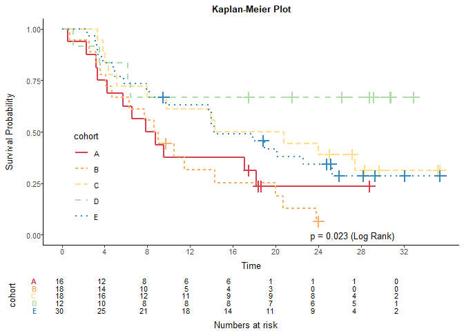
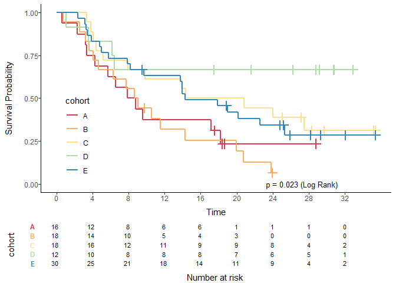

<!-- This file is used to create README.md
Note that the README.md document may need updating to change
'\<0.001' to '<0.001'. 
-->

# reportRmd

<!-- badges: start -->

[](https://lifecycle.r-lib.org/articles/stages.html#experimental)
[](https://CRAN.R-project.org/package=reportRmd)
<!-- badges: end -->

The goal of reportRmd is to automate the reporting of clinical data in
Rmarkdown environments. Functions include table one-style summary
statistics, compilation of multiple univariate models, tidy output of
multivariable models and side by side comparisons of univariate and
multivariable models. Plotting functions include customisable survival
curves, forest plots, and automated bivariate plots.

## Installation

You can install the development version of reportRmd from
[GitHub](https://github.com/) with:

``` r
# install.packages("devtools")
devtools::install_github("biostatsPMH/reportRmd")
```

## Examples

### Summary statistics by Sex

``` r
library(reportRmd)
data("pembrolizumab")
rm_covsum(data=pembrolizumab, maincov = 'sex',
covs=c('age','pdl1','change_ctdna_group'),
show.tests=TRUE)
```

<table class="table" style="margin-left: auto; margin-right: auto;">
<thead>
<tr>
<th style="text-align:left;">
</th>
<th style="text-align:right;">
Full Sample (n=94)
</th>
<th style="text-align:right;">
Female (n=58)
</th>
<th style="text-align:right;">
Male (n=36)
</th>
<th style="text-align:right;">
p-value
</th>
<th style="text-align:right;">
StatTest
</th>
</tr>
</thead>
<tbody>
<tr>
<td style="text-align:left;">
<span style=" font-weight: bold;    ">age</span>
</td>
<td style="text-align:right;">
</td>
<td style="text-align:right;">
</td>
<td style="text-align:right;">
</td>
<td style="text-align:right;">
0.30
</td>
<td style="text-align:right;">
Wilcoxon Rank Sum
</td>
</tr>
<tr>
<td style="text-align:left;padding-left: 2em;" indentlevel="1">
Mean (sd)
</td>
<td style="text-align:right;">
57.9 (12.8)
</td>
<td style="text-align:right;">
56.9 (12.6)
</td>
<td style="text-align:right;">
59.3 (13.1)
</td>
<td style="text-align:right;">
</td>
<td style="text-align:right;">
</td>
</tr>
<tr>
<td style="text-align:left;padding-left: 2em;" indentlevel="1">
Median (Min,Max)
</td>
<td style="text-align:right;">
59.1 (21.1,81.8)
</td>
<td style="text-align:right;">
56.6 (34.1,78.2)
</td>
<td style="text-align:right;">
61.2 (21.1,81.8)
</td>
<td style="text-align:right;">
</td>
<td style="text-align:right;">
</td>
</tr>
<tr>
<td style="text-align:left;">
<span style=" font-weight: bold;    ">pdl1</span>
</td>
<td style="text-align:right;">
</td>
<td style="text-align:right;">
</td>
<td style="text-align:right;">
</td>
<td style="text-align:right;">
0.76
</td>
<td style="text-align:right;">
Wilcoxon Rank Sum
</td>
</tr>
<tr>
<td style="text-align:left;padding-left: 2em;" indentlevel="1">
Mean (sd)
</td>
<td style="text-align:right;">
13.9 (29.2)
</td>
<td style="text-align:right;">
15.0 (30.5)
</td>
<td style="text-align:right;">
12.1 (27.3)
</td>
<td style="text-align:right;">
</td>
<td style="text-align:right;">
</td>
</tr>
<tr>
<td style="text-align:left;padding-left: 2em;" indentlevel="1">
Median (Min,Max)
</td>
<td style="text-align:right;">
0 (0,100)
</td>
<td style="text-align:right;">
0.5 (0.0,100.0)
</td>
<td style="text-align:right;">
0 (0,100)
</td>
<td style="text-align:right;">
</td>
<td style="text-align:right;">
</td>
</tr>
<tr>
<td style="text-align:left;padding-left: 2em;" indentlevel="1">
Missing
</td>
<td style="text-align:right;">
1
</td>
<td style="text-align:right;">
0
</td>
<td style="text-align:right;">
1
</td>
<td style="text-align:right;">
</td>
<td style="text-align:right;">
</td>
</tr>
<tr>
<td style="text-align:left;">
<span style=" font-weight: bold;    ">change ctdna group</span>
</td>
<td style="text-align:right;">
</td>
<td style="text-align:right;">
</td>
<td style="text-align:right;">
</td>
<td style="text-align:right;">
0.81
</td>
<td style="text-align:right;">
Fisher Exact
</td>
</tr>
<tr>
<td style="text-align:left;padding-left: 2em;" indentlevel="1">
Decrease from baseline
</td>
<td style="text-align:right;">
33 (45)
</td>
<td style="text-align:right;">
19 (48)
</td>
<td style="text-align:right;">
14 (42)
</td>
<td style="text-align:right;">
</td>
<td style="text-align:right;">
</td>
</tr>
<tr>
<td style="text-align:left;padding-left: 2em;" indentlevel="1">
Increase from baseline
</td>
<td style="text-align:right;">
40 (55)
</td>
<td style="text-align:right;">
21 (52)
</td>
<td style="text-align:right;">
19 (58)
</td>
<td style="text-align:right;">
</td>
<td style="text-align:right;">
</td>
</tr>
<tr>
<td style="text-align:left;padding-left: 2em;" indentlevel="1">
Missing
</td>
<td style="text-align:right;">
21
</td>
<td style="text-align:right;">
18
</td>
<td style="text-align:right;">
3
</td>
<td style="text-align:right;">
</td>
<td style="text-align:right;">
</td>
</tr>
</tbody>
</table>

### Multiple Univariate Regression Analyses

``` r
rm_uvsum(data=pembrolizumab, response='orr',
covs=c('age','cohort','pdl1','change_ctdna_group'))
```

<table class="table" style="margin-left: auto; margin-right: auto;">
<thead>
<tr>
<th style="text-align:left;">
</th>
<th style="text-align:right;">
OR(95%CI)
</th>
<th style="text-align:right;">
p-value
</th>
<th style="text-align:right;">
Global p-value
</th>
<th style="text-align:right;">
N
</th>
</tr>
</thead>
<tbody>
<tr>
<td style="text-align:left;">
<span style=" font-weight: bold;    ">age</span>
</td>
<td style="text-align:right;">
0.96 (0.91,1.01)
</td>
<td style="text-align:right;">
0.09
</td>
<td style="text-align:right;">
</td>
<td style="text-align:right;">
94
</td>
</tr>
<tr>
<td style="text-align:left;">
<span style=" font-weight: bold;    ">cohort</span>
</td>
<td style="text-align:right;">
</td>
<td style="text-align:right;">
</td>
<td style="text-align:right;">
<span style=" font-weight: bold;    ">\<0.001</span>
</td>
<td style="text-align:right;">
94
</td>
</tr>
<tr>
<td style="text-align:left;padding-left: 2em;" indentlevel="1">
A
</td>
<td style="text-align:right;">
Reference
</td>
<td style="text-align:right;">
</td>
<td style="text-align:right;">
</td>
<td style="text-align:right;">
16
</td>
</tr>
<tr>
<td style="text-align:left;padding-left: 2em;" indentlevel="1">
B
</td>
<td style="text-align:right;">
</td>
<td style="text-align:right;">
</td>
<td style="text-align:right;">
</td>
<td style="text-align:right;">
18
</td>
</tr>
<tr>
<td style="text-align:left;padding-left: 2em;" indentlevel="1">
C
</td>
<td style="text-align:right;">
</td>
<td style="text-align:right;">
</td>
<td style="text-align:right;">
</td>
<td style="text-align:right;">
18
</td>
</tr>
<tr>
<td style="text-align:left;padding-left: 2em;" indentlevel="1">
D
</td>
<td style="text-align:right;">
0.12 (0.02,0.66)
</td>
<td style="text-align:right;">
<span style=" font-weight: bold;    ">0.01</span>
</td>
<td style="text-align:right;">
</td>
<td style="text-align:right;">
12
</td>
</tr>
<tr>
<td style="text-align:left;padding-left: 2em;" indentlevel="1">
E
</td>
<td style="text-align:right;">
1.15 (0.24,5.60)
</td>
<td style="text-align:right;">
0.86
</td>
<td style="text-align:right;">
</td>
<td style="text-align:right;">
30
</td>
</tr>
<tr>
<td style="text-align:left;">
<span style=" font-weight: bold;    ">pdl1</span>
</td>
<td style="text-align:right;">
0.97 (0.95,0.99)
</td>
<td style="text-align:right;">
<span style=" font-weight: bold;    ">\<0.001</span>
</td>
<td style="text-align:right;">
</td>
<td style="text-align:right;">
93
</td>
</tr>
<tr>
<td style="text-align:left;">
<span style=" font-weight: bold;    ">change ctdna group</span>
</td>
<td style="text-align:right;">
</td>
<td style="text-align:right;">
<span style=" font-weight: bold;    ">0.002</span>
</td>
<td style="text-align:right;">
</td>
<td style="text-align:right;">
73
</td>
</tr>
<tr>
<td style="text-align:left;padding-left: 2em;" indentlevel="1">
Decrease from baseline
</td>
<td style="text-align:right;">
Reference
</td>
<td style="text-align:right;">
</td>
<td style="text-align:right;">
</td>
<td style="text-align:right;">
33
</td>
</tr>
<tr>
<td style="text-align:left;padding-left: 2em;" indentlevel="1">
Increase from baseline
</td>
<td style="text-align:right;">
28.74 (3.51,235.03)
</td>
<td style="text-align:right;">
</td>
<td style="text-align:right;">
</td>
<td style="text-align:right;">
40
</td>
</tr>
</tbody>
</table>

Hiding unstable estimates setting removeInf = TRUE:

``` r
rm_uvsum(data=pembrolizumab, response='orr',
covs=c('age','cohort','pdl1','change_ctdna_group'),removeInf = FALSE)
```

<table class="table" style="margin-left: auto; margin-right: auto;">
<thead>
<tr>
<th style="text-align:left;">
</th>
<th style="text-align:right;">
OR(95%CI)
</th>
<th style="text-align:right;">
p-value
</th>
<th style="text-align:right;">
Global p-value
</th>
<th style="text-align:right;">
N
</th>
</tr>
</thead>
<tbody>
<tr>
<td style="text-align:left;">
<span style=" font-weight: bold;    ">age</span>
</td>
<td style="text-align:right;">
0.96 (0.91,1.01)
</td>
<td style="text-align:right;">
0.09
</td>
<td style="text-align:right;">
</td>
<td style="text-align:right;">
94
</td>
</tr>
<tr>
<td style="text-align:left;">
<span style=" font-weight: bold;    ">cohort</span>
</td>
<td style="text-align:right;">
</td>
<td style="text-align:right;">
</td>
<td style="text-align:right;">
<span style=" font-weight: bold;    ">\<0.001</span>
</td>
<td style="text-align:right;">
94
</td>
</tr>
<tr>
<td style="text-align:left;padding-left: 2em;" indentlevel="1">
A
</td>
<td style="text-align:right;">
Reference
</td>
<td style="text-align:right;">
</td>
<td style="text-align:right;">
</td>
<td style="text-align:right;">
16
</td>
</tr>
<tr>
<td style="text-align:left;padding-left: 2em;" indentlevel="1">
B
</td>
<td style="text-align:right;">
7.3e+07 (0e+00,Inf)
</td>
<td style="text-align:right;">
0.99
</td>
<td style="text-align:right;">
</td>
<td style="text-align:right;">
18
</td>
</tr>
<tr>
<td style="text-align:left;padding-left: 2em;" indentlevel="1">
C
</td>
<td style="text-align:right;">
7.3e+07 (0e+00,Inf)
</td>
<td style="text-align:right;">
0.99
</td>
<td style="text-align:right;">
</td>
<td style="text-align:right;">
18
</td>
</tr>
<tr>
<td style="text-align:left;padding-left: 2em;" indentlevel="1">
D
</td>
<td style="text-align:right;">
0.12 (0.02,0.66)
</td>
<td style="text-align:right;">
<span style=" font-weight: bold;    ">0.01</span>
</td>
<td style="text-align:right;">
</td>
<td style="text-align:right;">
12
</td>
</tr>
<tr>
<td style="text-align:left;padding-left: 2em;" indentlevel="1">
E
</td>
<td style="text-align:right;">
1.15 (0.24,5.60)
</td>
<td style="text-align:right;">
0.86
</td>
<td style="text-align:right;">
</td>
<td style="text-align:right;">
30
</td>
</tr>
<tr>
<td style="text-align:left;">
<span style=" font-weight: bold;    ">pdl1</span>
</td>
<td style="text-align:right;">
0.97 (0.95,0.99)
</td>
<td style="text-align:right;">
<span style=" font-weight: bold;    ">\<0.001</span>
</td>
<td style="text-align:right;">
</td>
<td style="text-align:right;">
93
</td>
</tr>
<tr>
<td style="text-align:left;">
<span style=" font-weight: bold;    ">change ctdna group</span>
</td>
<td style="text-align:right;">
</td>
<td style="text-align:right;">
<span style=" font-weight: bold;    ">0.002</span>
</td>
<td style="text-align:right;">
</td>
<td style="text-align:right;">
73
</td>
</tr>
<tr>
<td style="text-align:left;padding-left: 2em;" indentlevel="1">
Decrease from baseline
</td>
<td style="text-align:right;">
Reference
</td>
<td style="text-align:right;">
</td>
<td style="text-align:right;">
</td>
<td style="text-align:right;">
33
</td>
</tr>
<tr>
<td style="text-align:left;padding-left: 2em;" indentlevel="1">
Increase from baseline
</td>
<td style="text-align:right;">
28.74 (3.51,235.03)
</td>
<td style="text-align:right;">
</td>
<td style="text-align:right;">
</td>
<td style="text-align:right;">
40
</td>
</tr>
</tbody>
</table>

### Tidy multivariable analysis

``` r
glm_fit <- glm(orr~change_ctdna_group+pdl1+cohort,
               family='binomial',
               data = pembrolizumab)
rm_mvsum(glm_fit)
```

<table class="table" style="margin-left: auto; margin-right: auto;">
<thead>
<tr>
<th style="text-align:left;">
</th>
<th style="text-align:right;">
OR(95%CI)
</th>
<th style="text-align:right;">
p-value
</th>
<th style="text-align:right;">
Global p-value
</th>
</tr>
</thead>
<tbody>
<tr>
<td style="text-align:left;">
<span style=" font-weight: bold;    ">change ctdna group</span>
</td>
<td style="text-align:right;">
</td>
<td style="text-align:right;">
<span style=" font-weight: bold;    ">0.009</span>
</td>
<td style="text-align:right;">
</td>
</tr>
<tr>
<td style="text-align:left;padding-left: 2em;" indentlevel="1">
Decrease from baseline
</td>
<td style="text-align:right;">
Reference
</td>
<td style="text-align:right;">
</td>
<td style="text-align:right;">
</td>
</tr>
<tr>
<td style="text-align:left;padding-left: 2em;" indentlevel="1">
Increase from baseline
</td>
<td style="text-align:right;">
19.99 (2.08,191.60)
</td>
<td style="text-align:right;">
</td>
<td style="text-align:right;">
</td>
</tr>
<tr>
<td style="text-align:left;">
<span style=" font-weight: bold;    ">pdl1</span>
</td>
<td style="text-align:right;">
0.97 (0.95,1.00)
</td>
<td style="text-align:right;">
0.07
</td>
<td style="text-align:right;">
</td>
</tr>
<tr>
<td style="text-align:left;">
<span style=" font-weight: bold;    ">cohort</span>
</td>
<td style="text-align:right;">
</td>
<td style="text-align:right;">
</td>
<td style="text-align:right;">
<span style=" font-weight: bold;    ">0.004</span>
</td>
</tr>
<tr>
<td style="text-align:left;padding-left: 2em;" indentlevel="1">
A
</td>
<td style="text-align:right;">
Reference
</td>
<td style="text-align:right;">
</td>
<td style="text-align:right;">
</td>
</tr>
<tr>
<td style="text-align:left;padding-left: 2em;" indentlevel="1">
B
</td>
<td style="text-align:right;">
2.6e+07 (0e+00,Inf)
</td>
<td style="text-align:right;">
1.00
</td>
<td style="text-align:right;">
</td>
</tr>
<tr>
<td style="text-align:left;padding-left: 2em;" indentlevel="1">
C
</td>
<td style="text-align:right;">
4.2e+07 (0e+00,Inf)
</td>
<td style="text-align:right;">
1.00
</td>
<td style="text-align:right;">
</td>
</tr>
<tr>
<td style="text-align:left;padding-left: 2em;" indentlevel="1">
D
</td>
<td style="text-align:right;">
0.07 (4.2e-03,1.09)
</td>
<td style="text-align:right;">
0.06
</td>
<td style="text-align:right;">
</td>
</tr>
<tr>
<td style="text-align:left;padding-left: 2em;" indentlevel="1">
E
</td>
<td style="text-align:right;">
0.44 (0.04,5.10)
</td>
<td style="text-align:right;">
0.51
</td>
<td style="text-align:right;">
</td>
</tr>
</tbody>
</table>

### Combining univariate and multivariable models

``` r
uvsumTable <- rm_uvsum(data=pembrolizumab, response='orr',
covs=c('age','cohort','pdl1','change_ctdna_group'),tableOnly = TRUE)
#> Warning in rm_uvsum(data = pembrolizumab, response = "orr", covs = c("age", :
#> Covariates with unstable estimates:B,C.

glm_fit <- glm(orr~change_ctdna_group+pdl1+cohort,
               family='binomial',
               data = pembrolizumab)
mvsumTable <- rm_mvsum(glm_fit,tableOnly = TRUE)

rm_uv_mv(uvsumTable,mvsumTable)
```

<table class="table" style="margin-left: auto; margin-right: auto;">
<thead>
<tr>
<th style="text-align:left;">
</th>
<th style="text-align:right;">
Unadjusted OR(95%CI)
</th>
<th style="text-align:right;">
N
</th>
<th style="text-align:right;">
p
</th>
<th style="text-align:right;">
Adjusted OR(95%CI)
</th>
<th style="text-align:right;">
p (adj)
</th>
</tr>
</thead>
<tbody>
<tr>
<td style="text-align:left;">
<span style=" font-weight: bold;    ">age</span>
</td>
<td style="text-align:right;">
0.96 (0.91,1.01)
</td>
<td style="text-align:right;">
94
</td>
<td style="text-align:right;">
0.09
</td>
<td style="text-align:right;">
</td>
<td style="text-align:right;">
</td>
</tr>
<tr>
<td style="text-align:left;">
<span style=" font-weight: bold;    ">cohort</span>
</td>
<td style="text-align:right;">
</td>
<td style="text-align:right;">
94
</td>
<td style="text-align:right;">
<span style=" font-weight: bold;    ">\<0.001</span>
</td>
<td style="text-align:right;">
</td>
<td style="text-align:right;">
<span style=" font-weight: bold;    ">0.004</span>
</td>
</tr>
<tr>
<td style="text-align:left;padding-left: 2em;" indentlevel="1">
A
</td>
<td style="text-align:right;">
Reference
</td>
<td style="text-align:right;">
16
</td>
<td style="text-align:right;">
</td>
<td style="text-align:right;">
Reference
</td>
<td style="text-align:right;">
</td>
</tr>
<tr>
<td style="text-align:left;padding-left: 2em;" indentlevel="1">
B
</td>
<td style="text-align:right;">
</td>
<td style="text-align:right;">
18
</td>
<td style="text-align:right;">
</td>
<td style="text-align:right;">
2.6e+07 (0e+00,Inf)
</td>
<td style="text-align:right;">
1.00
</td>
</tr>
<tr>
<td style="text-align:left;padding-left: 2em;" indentlevel="1">
C
</td>
<td style="text-align:right;">
</td>
<td style="text-align:right;">
18
</td>
<td style="text-align:right;">
</td>
<td style="text-align:right;">
4.2e+07 (0e+00,Inf)
</td>
<td style="text-align:right;">
1.00
</td>
</tr>
<tr>
<td style="text-align:left;padding-left: 2em;" indentlevel="1">
D
</td>
<td style="text-align:right;">
0.12 (0.02,0.66)
</td>
<td style="text-align:right;">
12
</td>
<td style="text-align:right;">
<span style=" font-weight: bold;    ">0.01</span>
</td>
<td style="text-align:right;">
0.07 (4.2e-03,1.09)
</td>
<td style="text-align:right;">
0.06
</td>
</tr>
<tr>
<td style="text-align:left;padding-left: 2em;" indentlevel="1">
E
</td>
<td style="text-align:right;">
1.15 (0.24,5.60)
</td>
<td style="text-align:right;">
30
</td>
<td style="text-align:right;">
0.86
</td>
<td style="text-align:right;">
0.44 (0.04,5.10)
</td>
<td style="text-align:right;">
0.51
</td>
</tr>
<tr>
<td style="text-align:left;">
<span style=" font-weight: bold;    ">pdl1</span>
</td>
<td style="text-align:right;">
0.97 (0.95,0.99)
</td>
<td style="text-align:right;">
93
</td>
<td style="text-align:right;">
<span style=" font-weight: bold;    ">\<0.001</span>
</td>
<td style="text-align:right;">
0.97 (0.95,1.00)
</td>
<td style="text-align:right;">
0.07
</td>
</tr>
<tr>
<td style="text-align:left;">
<span style=" font-weight: bold;    ">change ctdna group</span>
</td>
<td style="text-align:right;">
</td>
<td style="text-align:right;">
73
</td>
<td style="text-align:right;">
<span style=" font-weight: bold;    ">0.002</span>
</td>
<td style="text-align:right;">
</td>
<td style="text-align:right;">
<span style=" font-weight: bold;    ">0.009</span>
</td>
</tr>
<tr>
<td style="text-align:left;padding-left: 2em;" indentlevel="1">
Decrease from baseline
</td>
<td style="text-align:right;">
Reference
</td>
<td style="text-align:right;">
33
</td>
<td style="text-align:right;">
</td>
<td style="text-align:right;">
Reference
</td>
<td style="text-align:right;">
</td>
</tr>
<tr>
<td style="text-align:left;padding-left: 2em;" indentlevel="1">
Increase from baseline
</td>
<td style="text-align:right;">
28.74 (3.51,235.03)
</td>
<td style="text-align:right;">
40
</td>
<td style="text-align:right;">
</td>
<td style="text-align:right;">
19.99 (2.08,191.60)
</td>
<td style="text-align:right;">
</td>
</tr>
</tbody>
</table>

### Plotting survival curves

``` r
ggkmcif(response = c('os_time','os_status'),
cov='cohort',
data=pembrolizumab)
```


### Plotting odds ratios

``` r
require(ggplot2)
#> Loading required package: ggplot2
forestplot2(glm_fit)
#> Warning: Transformation introduced infinite values in continuous x-axis
```



### Plotting bivariate relationships

These plots are designed for quick inspection of many variables, not for
publication.

``` r
require(ggplot2)
plotuv(data=pembrolizumab, response='orr',
covs=c('age','cohort','pdl1','change_ctdna_group'))
#> Boxplots not shown for categories with fewer than 20 observations.
#> Boxplots not shown for categories with fewer than 20 observations.
```


