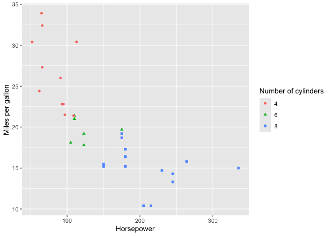

<!-- This file is used to create README.md
Note that the README.md document may need updating to change
'\<0.001' to '<0.001'. 
-->

# reportRmd

<!-- badges: start -->

[](https://lifecycle.r-lib.org/articles/stages.html#stable)
[](https://CRAN.R-project.org/package=reportRmd)
[](https://cran.r-project.org/package=reportRmd)
<!-- badges: end -->

The goal of reportRmd is to automate the reporting of clinical data in
Quarto/Rmarkdown environments. Functions include table one-style summary
statistics, compilation of multiple univariate models, tidy output of
multivariable models and side by side comparisons of univariate and
multivariable models. Plotting functions include customisable survival
curves, forest plots, and automated bivariate plots.

## Installation

Installing from CRAN:

``` r
install.packages('reportRmd')
```

You can install the development version of reportRmd from
[GitHub](https://github.com/) with:

``` r
# install.packages("devtools")
devtools::install_github("biostatsPMH/reportRmd", ref="development", build_vignettes = TRUE)
```

## New Features (v0.1.3)

- `rm_mvsum()` and `forestplotMV()` now support
  `include_unadjusted=TRUE` to display univariate (unadjusted) and
  multivariable (adjusted) estimates side-by-side
- `forestplotMV()` data parameter is now optional - data extracted
  automatically from model objects

## Documentation

For the CRAN version:

[Online Documentation](https://biostatsPMH.github.io/reportRmd/)

For the Development version run the following and select HTML on the
webpage

``` r
browseVignettes("reportRmd")
```

## Examples

### Summary statistics by Sex

``` r
library(reportRmd)
data("pembrolizumab")

rm_covsum(data=pembrolizumab, maincov = 'sex',
covs=c('age','pdl1','change_ctdna_group'),
show.tests=TRUE)
```

<table class="table table" style="margin-left: auto; margin-right: auto; margin-left: auto; margin-right: auto;">

<thead>

<tr>

<th style="text-align:left;position: sticky; top:0; background-color: #FFFFFF;">

</th>

<th style="text-align:right;position: sticky; top:0; background-color: #FFFFFF;">

Full Sample (n=94)
</th>

<th style="text-align:right;position: sticky; top:0; background-color: #FFFFFF;">

Female (n=58)
</th>

<th style="text-align:right;position: sticky; top:0; background-color: #FFFFFF;">

Male (n=36)
</th>

<th style="text-align:right;position: sticky; top:0; background-color: #FFFFFF;">

p-value
</th>

<th style="text-align:right;position: sticky; top:0; background-color: #FFFFFF;">

StatTest
</th>

</tr>

</thead>

<tbody>

<tr>

<td style="text-align:left;">

<span style="font-weight: bold;">Age at study entry</span>
</td>

<td style="text-align:right;">

</td>

<td style="text-align:right;">

</td>

<td style="text-align:right;">

</td>

<td style="text-align:right;">

0.30
</td>

<td style="text-align:right;">

Wilcoxon Rank Sum
</td>

</tr>

<tr>

<td style="text-align:left;padding-left: 2em;" indentlevel="1">

Mean (sd)
</td>

<td style="text-align:right;">

57.9 (12.8)
</td>

<td style="text-align:right;">

56.9 (12.6)
</td>

<td style="text-align:right;">

59.3 (13.1)
</td>

<td style="text-align:right;">

</td>

<td style="text-align:right;">

</td>

</tr>

<tr>

<td style="text-align:left;padding-left: 2em;" indentlevel="1">

Median (Min,Max)
</td>

<td style="text-align:right;">

59.1 (21.1, 81.8)
</td>

<td style="text-align:right;">

56.6 (34.1, 78.2)
</td>

<td style="text-align:right;">

61.2 (21.1, 81.8)
</td>

<td style="text-align:right;">

</td>

<td style="text-align:right;">

</td>

</tr>

<tr>

<td style="text-align:left;">

<span style="font-weight: bold;">PD L1 percent</span>
</td>

<td style="text-align:right;">

</td>

<td style="text-align:right;">

</td>

<td style="text-align:right;">

</td>

<td style="text-align:right;">

0.76
</td>

<td style="text-align:right;">

Wilcoxon Rank Sum
</td>

</tr>

<tr>

<td style="text-align:left;padding-left: 2em;" indentlevel="1">

Mean (sd)
</td>

<td style="text-align:right;">

13.9 (29.2)
</td>

<td style="text-align:right;">

15.0 (30.5)
</td>

<td style="text-align:right;">

12.1 (27.3)
</td>

<td style="text-align:right;">

</td>

<td style="text-align:right;">

</td>

</tr>

<tr>

<td style="text-align:left;padding-left: 2em;" indentlevel="1">

Median (Min,Max)
</td>

<td style="text-align:right;">

0 (0, 100)
</td>

<td style="text-align:right;">

0.5 (0.0, 100.0)
</td>

<td style="text-align:right;">

0 (0, 100)
</td>

<td style="text-align:right;">

</td>

<td style="text-align:right;">

</td>

</tr>

<tr>

<td style="text-align:left;padding-left: 2em;" indentlevel="1">

Missing
</td>

<td style="text-align:right;">

1
</td>

<td style="text-align:right;">

0
</td>

<td style="text-align:right;">

1
</td>

<td style="text-align:right;">

</td>

<td style="text-align:right;">

</td>

</tr>

<tr>

<td style="text-align:left;">

<span style="font-weight: bold;">Did ctDNA increase or decrease from
baseline to cycle 3</span>
</td>

<td style="text-align:right;">

</td>

<td style="text-align:right;">

</td>

<td style="text-align:right;">

</td>

<td style="text-align:right;">

0.84
</td>

<td style="text-align:right;">

Chi Sq
</td>

</tr>

<tr>

<td style="text-align:left;padding-left: 2em;" indentlevel="1">

Decrease from baseline
</td>

<td style="text-align:right;">

33 (45)
</td>

<td style="text-align:right;">

19 (48)
</td>

<td style="text-align:right;">

14 (42)
</td>

<td style="text-align:right;">

</td>

<td style="text-align:right;">

</td>

</tr>

<tr>

<td style="text-align:left;padding-left: 2em;" indentlevel="1">

Increase from baseline
</td>

<td style="text-align:right;">

40 (55)
</td>

<td style="text-align:right;">

21 (52)
</td>

<td style="text-align:right;">

19 (58)
</td>

<td style="text-align:right;">

</td>

<td style="text-align:right;">

</td>

</tr>

<tr>

<td style="text-align:left;padding-left: 2em;" indentlevel="1">

Missing
</td>

<td style="text-align:right;">

21
</td>

<td style="text-align:right;">

18
</td>

<td style="text-align:right;">

3
</td>

<td style="text-align:right;">

</td>

<td style="text-align:right;">

</td>

</tr>

</tbody>

</table>

### Compact Table

``` r
pembrolizumab |> rm_compactsum( grp = 'sex',
xvars=c('age','pdl1','change_ctdna_group'))
```

<table class="table table" style="margin-left: auto; margin-right: auto; margin-left: auto; margin-right: auto;">

<thead>

<tr>

<th style="text-align:left;position: sticky; top:0; background-color: #FFFFFF;">

</th>

<th style="text-align:right;position: sticky; top:0; background-color: #FFFFFF;">

Full Sample (n=94)
</th>

<th style="text-align:right;position: sticky; top:0; background-color: #FFFFFF;">

Female (n=58)
</th>

<th style="text-align:right;position: sticky; top:0; background-color: #FFFFFF;">

Male (n=36)
</th>

<th style="text-align:right;position: sticky; top:0; background-color: #FFFFFF;">

p-value
</th>

<th style="text-align:right;position: sticky; top:0; background-color: #FFFFFF;">

Missing
</th>

</tr>

</thead>

<tbody>

<tr>

<td style="text-align:left;">

<span style="font-weight: bold;">Age at study entry</span>
</td>

<td style="text-align:right;">

59.1 (49.5-68.7)
</td>

<td style="text-align:right;">

56.6 (45.8-67.8)
</td>

<td style="text-align:right;">

61.2 (52.0-69.4)
</td>

<td style="text-align:right;">

0.30
</td>

<td style="text-align:right;">

0
</td>

</tr>

<tr>

<td style="text-align:left;">

<span style="font-weight: bold;">PD L1 percent</span>
</td>

<td style="text-align:right;">

0.0 (0.0-10.0)
</td>

<td style="text-align:right;">

0.5 (0.0-13.8)
</td>

<td style="text-align:right;">

0.0 (0.0-4.5)
</td>

<td style="text-align:right;">

0.76
</td>

<td style="text-align:right;">

1
</td>

</tr>

<tr>

<td style="text-align:left;">

<span style="font-weight: bold;">Did ctDNA increase or decrease from
baseline to cycle 3 - Increase from baseline</span>
</td>

<td style="text-align:right;">

40 (55%)
</td>

<td style="text-align:right;">

21 (52%)
</td>

<td style="text-align:right;">

19 (58%)
</td>

<td style="text-align:right;">

0.84
</td>

<td style="text-align:right;">

21
</td>

</tr>

</tbody>

</table>

### Switching between function

As of v0.1.3 you can now use `xvars` and `grp` as aliases for covs and
maincov in `rm_covsum`.

``` r
rm_covsum(data=pembrolizumab, grp = 'sex',
xvars=c('age','pdl1','change_ctdna_group'),
show.tests=TRUE)
```

<table class="table table" style="margin-left: auto; margin-right: auto; margin-left: auto; margin-right: auto;">

<thead>

<tr>

<th style="text-align:left;position: sticky; top:0; background-color: #FFFFFF;">

</th>

<th style="text-align:right;position: sticky; top:0; background-color: #FFFFFF;">

Full Sample (n=94)
</th>

<th style="text-align:right;position: sticky; top:0; background-color: #FFFFFF;">

Female (n=58)
</th>

<th style="text-align:right;position: sticky; top:0; background-color: #FFFFFF;">

Male (n=36)
</th>

<th style="text-align:right;position: sticky; top:0; background-color: #FFFFFF;">

p-value
</th>

<th style="text-align:right;position: sticky; top:0; background-color: #FFFFFF;">

StatTest
</th>

</tr>

</thead>

<tbody>

<tr>

<td style="text-align:left;">

<span style="font-weight: bold;">Age at study entry</span>
</td>

<td style="text-align:right;">

</td>

<td style="text-align:right;">

</td>

<td style="text-align:right;">

</td>

<td style="text-align:right;">

0.30
</td>

<td style="text-align:right;">

Wilcoxon Rank Sum
</td>

</tr>

<tr>

<td style="text-align:left;padding-left: 2em;" indentlevel="1">

Mean (sd)
</td>

<td style="text-align:right;">

57.9 (12.8)
</td>

<td style="text-align:right;">

56.9 (12.6)
</td>

<td style="text-align:right;">

59.3 (13.1)
</td>

<td style="text-align:right;">

</td>

<td style="text-align:right;">

</td>

</tr>

<tr>

<td style="text-align:left;padding-left: 2em;" indentlevel="1">

Median (Min,Max)
</td>

<td style="text-align:right;">

59.1 (21.1, 81.8)
</td>

<td style="text-align:right;">

56.6 (34.1, 78.2)
</td>

<td style="text-align:right;">

61.2 (21.1, 81.8)
</td>

<td style="text-align:right;">

</td>

<td style="text-align:right;">

</td>

</tr>

<tr>

<td style="text-align:left;">

<span style="font-weight: bold;">PD L1 percent</span>
</td>

<td style="text-align:right;">

</td>

<td style="text-align:right;">

</td>

<td style="text-align:right;">

</td>

<td style="text-align:right;">

0.76
</td>

<td style="text-align:right;">

Wilcoxon Rank Sum
</td>

</tr>

<tr>

<td style="text-align:left;padding-left: 2em;" indentlevel="1">

Mean (sd)
</td>

<td style="text-align:right;">

13.9 (29.2)
</td>

<td style="text-align:right;">

15.0 (30.5)
</td>

<td style="text-align:right;">

12.1 (27.3)
</td>

<td style="text-align:right;">

</td>

<td style="text-align:right;">

</td>

</tr>

<tr>

<td style="text-align:left;padding-left: 2em;" indentlevel="1">

Median (Min,Max)
</td>

<td style="text-align:right;">

0 (0, 100)
</td>

<td style="text-align:right;">

0.5 (0.0, 100.0)
</td>

<td style="text-align:right;">

0 (0, 100)
</td>

<td style="text-align:right;">

</td>

<td style="text-align:right;">

</td>

</tr>

<tr>

<td style="text-align:left;padding-left: 2em;" indentlevel="1">

Missing
</td>

<td style="text-align:right;">

1
</td>

<td style="text-align:right;">

0
</td>

<td style="text-align:right;">

1
</td>

<td style="text-align:right;">

</td>

<td style="text-align:right;">

</td>

</tr>

<tr>

<td style="text-align:left;">

<span style="font-weight: bold;">Did ctDNA increase or decrease from
baseline to cycle 3</span>
</td>

<td style="text-align:right;">

</td>

<td style="text-align:right;">

</td>

<td style="text-align:right;">

</td>

<td style="text-align:right;">

0.84
</td>

<td style="text-align:right;">

Chi Sq
</td>

</tr>

<tr>

<td style="text-align:left;padding-left: 2em;" indentlevel="1">

Decrease from baseline
</td>

<td style="text-align:right;">

33 (45)
</td>

<td style="text-align:right;">

19 (48)
</td>

<td style="text-align:right;">

14 (42)
</td>

<td style="text-align:right;">

</td>

<td style="text-align:right;">

</td>

</tr>

<tr>

<td style="text-align:left;padding-left: 2em;" indentlevel="1">

Increase from baseline
</td>

<td style="text-align:right;">

40 (55)
</td>

<td style="text-align:right;">

21 (52)
</td>

<td style="text-align:right;">

19 (58)
</td>

<td style="text-align:right;">

</td>

<td style="text-align:right;">

</td>

</tr>

<tr>

<td style="text-align:left;padding-left: 2em;" indentlevel="1">

Missing
</td>

<td style="text-align:right;">

21
</td>

<td style="text-align:right;">

18
</td>

<td style="text-align:right;">

3
</td>

<td style="text-align:right;">

</td>

<td style="text-align:right;">

</td>

</tr>

</tbody>

</table>

``` r
rm_covsum(data=pembrolizumab, grp = 'sex',
xvars=c('age','pdl1','change_ctdna_group'),
show.tests=TRUE)
```

<table class="table table" style="margin-left: auto; margin-right: auto; margin-left: auto; margin-right: auto;">

<thead>

<tr>

<th style="text-align:left;position: sticky; top:0; background-color: #FFFFFF;">

</th>

<th style="text-align:right;position: sticky; top:0; background-color: #FFFFFF;">

Full Sample (n=94)
</th>

<th style="text-align:right;position: sticky; top:0; background-color: #FFFFFF;">

Female (n=58)
</th>

<th style="text-align:right;position: sticky; top:0; background-color: #FFFFFF;">

Male (n=36)
</th>

<th style="text-align:right;position: sticky; top:0; background-color: #FFFFFF;">

p-value
</th>

<th style="text-align:right;position: sticky; top:0; background-color: #FFFFFF;">

StatTest
</th>

</tr>

</thead>

<tbody>

<tr>

<td style="text-align:left;">

<span style="font-weight: bold;">Age at study entry</span>
</td>

<td style="text-align:right;">

</td>

<td style="text-align:right;">

</td>

<td style="text-align:right;">

</td>

<td style="text-align:right;">

0.30
</td>

<td style="text-align:right;">

Wilcoxon Rank Sum
</td>

</tr>

<tr>

<td style="text-align:left;padding-left: 2em;" indentlevel="1">

Mean (sd)
</td>

<td style="text-align:right;">

57.9 (12.8)
</td>

<td style="text-align:right;">

56.9 (12.6)
</td>

<td style="text-align:right;">

59.3 (13.1)
</td>

<td style="text-align:right;">

</td>

<td style="text-align:right;">

</td>

</tr>

<tr>

<td style="text-align:left;padding-left: 2em;" indentlevel="1">

Median (Min,Max)
</td>

<td style="text-align:right;">

59.1 (21.1, 81.8)
</td>

<td style="text-align:right;">

56.6 (34.1, 78.2)
</td>

<td style="text-align:right;">

61.2 (21.1, 81.8)
</td>

<td style="text-align:right;">

</td>

<td style="text-align:right;">

</td>

</tr>

<tr>

<td style="text-align:left;">

<span style="font-weight: bold;">PD L1 percent</span>
</td>

<td style="text-align:right;">

</td>

<td style="text-align:right;">

</td>

<td style="text-align:right;">

</td>

<td style="text-align:right;">

0.76
</td>

<td style="text-align:right;">

Wilcoxon Rank Sum
</td>

</tr>

<tr>

<td style="text-align:left;padding-left: 2em;" indentlevel="1">

Mean (sd)
</td>

<td style="text-align:right;">

13.9 (29.2)
</td>

<td style="text-align:right;">

15.0 (30.5)
</td>

<td style="text-align:right;">

12.1 (27.3)
</td>

<td style="text-align:right;">

</td>

<td style="text-align:right;">

</td>

</tr>

<tr>

<td style="text-align:left;padding-left: 2em;" indentlevel="1">

Median (Min,Max)
</td>

<td style="text-align:right;">

0 (0, 100)
</td>

<td style="text-align:right;">

0.5 (0.0, 100.0)
</td>

<td style="text-align:right;">

0 (0, 100)
</td>

<td style="text-align:right;">

</td>

<td style="text-align:right;">

</td>

</tr>

<tr>

<td style="text-align:left;padding-left: 2em;" indentlevel="1">

Missing
</td>

<td style="text-align:right;">

1
</td>

<td style="text-align:right;">

0
</td>

<td style="text-align:right;">

1
</td>

<td style="text-align:right;">

</td>

<td style="text-align:right;">

</td>

</tr>

<tr>

<td style="text-align:left;">

<span style="font-weight: bold;">Did ctDNA increase or decrease from
baseline to cycle 3</span>
</td>

<td style="text-align:right;">

</td>

<td style="text-align:right;">

</td>

<td style="text-align:right;">

</td>

<td style="text-align:right;">

0.84
</td>

<td style="text-align:right;">

Chi Sq
</td>

</tr>

<tr>

<td style="text-align:left;padding-left: 2em;" indentlevel="1">

Decrease from baseline
</td>

<td style="text-align:right;">

33 (45)
</td>

<td style="text-align:right;">

19 (48)
</td>

<td style="text-align:right;">

14 (42)
</td>

<td style="text-align:right;">

</td>

<td style="text-align:right;">

</td>

</tr>

<tr>

<td style="text-align:left;padding-left: 2em;" indentlevel="1">

Increase from baseline
</td>

<td style="text-align:right;">

40 (55)
</td>

<td style="text-align:right;">

21 (52)
</td>

<td style="text-align:right;">

19 (58)
</td>

<td style="text-align:right;">

</td>

<td style="text-align:right;">

</td>

</tr>

<tr>

<td style="text-align:left;padding-left: 2em;" indentlevel="1">

Missing
</td>

<td style="text-align:right;">

21
</td>

<td style="text-align:right;">

18
</td>

<td style="text-align:right;">

3
</td>

<td style="text-align:right;">

</td>

<td style="text-align:right;">

</td>

</tr>

</tbody>

</table>

### Using Variable Labels

``` r
var_names <- data.frame(var=c("age","pdl1","change_ctdna_group"),
                          label=c('Age at study entry',
                                  'PD L1 percent',
                                  'ctDNA change from baseline to cycle 3'))

pembrolizumab <- set_labels(pembrolizumab,var_names)

rm_covsum(data=pembrolizumab, maincov = 'sex',
covs=c('age','pdl1','change_ctdna_group'))
```

<table class="table table" style="margin-left: auto; margin-right: auto; margin-left: auto; margin-right: auto;">

<thead>

<tr>

<th style="text-align:left;position: sticky; top:0; background-color: #FFFFFF;">

</th>

<th style="text-align:right;position: sticky; top:0; background-color: #FFFFFF;">

Full Sample (n=94)
</th>

<th style="text-align:right;position: sticky; top:0; background-color: #FFFFFF;">

Female (n=58)
</th>

<th style="text-align:right;position: sticky; top:0; background-color: #FFFFFF;">

Male (n=36)
</th>

<th style="text-align:right;position: sticky; top:0; background-color: #FFFFFF;">

p-value
</th>

</tr>

</thead>

<tbody>

<tr>

<td style="text-align:left;">

<span style="font-weight: bold;">Age at study entry</span>
</td>

<td style="text-align:right;">

</td>

<td style="text-align:right;">

</td>

<td style="text-align:right;">

</td>

<td style="text-align:right;">

0.30
</td>

</tr>

<tr>

<td style="text-align:left;padding-left: 2em;" indentlevel="1">

Mean (sd)
</td>

<td style="text-align:right;">

57.9 (12.8)
</td>

<td style="text-align:right;">

56.9 (12.6)
</td>

<td style="text-align:right;">

59.3 (13.1)
</td>

<td style="text-align:right;">

</td>

</tr>

<tr>

<td style="text-align:left;padding-left: 2em;" indentlevel="1">

Median (Min,Max)
</td>

<td style="text-align:right;">

59.1 (21.1, 81.8)
</td>

<td style="text-align:right;">

56.6 (34.1, 78.2)
</td>

<td style="text-align:right;">

61.2 (21.1, 81.8)
</td>

<td style="text-align:right;">

</td>

</tr>

<tr>

<td style="text-align:left;">

<span style="font-weight: bold;">PD L1 percent</span>
</td>

<td style="text-align:right;">

</td>

<td style="text-align:right;">

</td>

<td style="text-align:right;">

</td>

<td style="text-align:right;">

0.76
</td>

</tr>

<tr>

<td style="text-align:left;padding-left: 2em;" indentlevel="1">

Mean (sd)
</td>

<td style="text-align:right;">

13.9 (29.2)
</td>

<td style="text-align:right;">

15.0 (30.5)
</td>

<td style="text-align:right;">

12.1 (27.3)
</td>

<td style="text-align:right;">

</td>

</tr>

<tr>

<td style="text-align:left;padding-left: 2em;" indentlevel="1">

Median (Min,Max)
</td>

<td style="text-align:right;">

0 (0, 100)
</td>

<td style="text-align:right;">

0.5 (0.0, 100.0)
</td>

<td style="text-align:right;">

0 (0, 100)
</td>

<td style="text-align:right;">

</td>

</tr>

<tr>

<td style="text-align:left;padding-left: 2em;" indentlevel="1">

Missing
</td>

<td style="text-align:right;">

1
</td>

<td style="text-align:right;">

0
</td>

<td style="text-align:right;">

1
</td>

<td style="text-align:right;">

</td>

</tr>

<tr>

<td style="text-align:left;">

<span style="font-weight: bold;">ctDNA change from baseline to cycle
3</span>
</td>

<td style="text-align:right;">

</td>

<td style="text-align:right;">

</td>

<td style="text-align:right;">

</td>

<td style="text-align:right;">

0.84
</td>

</tr>

<tr>

<td style="text-align:left;padding-left: 2em;" indentlevel="1">

Decrease from baseline
</td>

<td style="text-align:right;">

33 (45)
</td>

<td style="text-align:right;">

19 (48)
</td>

<td style="text-align:right;">

14 (42)
</td>

<td style="text-align:right;">

</td>

</tr>

<tr>

<td style="text-align:left;padding-left: 2em;" indentlevel="1">

Increase from baseline
</td>

<td style="text-align:right;">

40 (55)
</td>

<td style="text-align:right;">

21 (52)
</td>

<td style="text-align:right;">

19 (58)
</td>

<td style="text-align:right;">

</td>

</tr>

<tr>

<td style="text-align:left;padding-left: 2em;" indentlevel="1">

Missing
</td>

<td style="text-align:right;">

21
</td>

<td style="text-align:right;">

18
</td>

<td style="text-align:right;">

3
</td>

<td style="text-align:right;">

</td>

</tr>

</tbody>

</table>

### Multiple Univariate Regression Analyses

``` r
rm_uvsum(data=pembrolizumab, response='orr',
covs=c('age','pdl1','change_ctdna_group'))
```

<table class="table table" style="margin-left: auto; margin-right: auto; margin-left: auto; margin-right: auto;">

<thead>

<tr>

<th style="text-align:left;position: sticky; top:0; background-color: #FFFFFF;">

</th>

<th style="text-align:right;position: sticky; top:0; background-color: #FFFFFF;">

OR(95%CI)
</th>

<th style="text-align:right;position: sticky; top:0; background-color: #FFFFFF;">

p-value
</th>

<th style="text-align:right;position: sticky; top:0; background-color: #FFFFFF;">

N
</th>

<th style="text-align:right;position: sticky; top:0; background-color: #FFFFFF;">

Event
</th>

</tr>

</thead>

<tbody>

<tr>

<td style="text-align:left;">

<span style="font-weight: bold;">Age at study entry</span>
</td>

<td style="text-align:right;">

0.96 (0.91, 1.00)
</td>

<td style="text-align:right;">

0.089
</td>

<td style="text-align:right;">

94
</td>

<td style="text-align:right;">

78
</td>

</tr>

<tr>

<td style="text-align:left;">

<span style="font-weight: bold;">PD L1 percent</span>
</td>

<td style="text-align:right;">

0.97 (0.95, 0.98)
</td>

<td style="text-align:right;">

<span style="font-weight: bold;">\<0.001</span>
</td>

<td style="text-align:right;">

93
</td>

<td style="text-align:right;">

77
</td>

</tr>

<tr>

<td style="text-align:left;">

<span style="font-weight: bold;">ctDNA change from baseline to cycle
3</span>
</td>

<td style="text-align:right;">

</td>

<td style="text-align:right;">

</td>

<td style="text-align:right;">

73
</td>

<td style="text-align:right;">

58
</td>

</tr>

<tr>

<td style="text-align:left;padding-left: 2em;" indentlevel="1">

Decrease from baseline
</td>

<td style="text-align:right;">

Reference
</td>

<td style="text-align:right;">

</td>

<td style="text-align:right;">

33
</td>

<td style="text-align:right;">

19
</td>

</tr>

<tr>

<td style="text-align:left;padding-left: 2em;" indentlevel="1">

Increase from baseline
</td>

<td style="text-align:right;">

28.74 (5.20, 540.18)
</td>

<td style="text-align:right;">

<span style="font-weight: bold;">0.002</span>
</td>

<td style="text-align:right;">

40
</td>

<td style="text-align:right;">

39
</td>

</tr>

</tbody>

</table>

### Tidy multivariable analysis

``` r
glm_fit <- glm(orr~change_ctdna_group+pdl1+age,
               family='binomial',
               data = pembrolizumab)
rm_mvsum(glm_fit,showN=T)
```

<table class="table table" style="margin-left: auto; margin-right: auto; margin-left: auto; margin-right: auto;">

<thead>

<tr>

<th style="text-align:left;position: sticky; top:0; background-color: #FFFFFF;">

</th>

<th style="text-align:right;position: sticky; top:0; background-color: #FFFFFF;">

OR(95%CI)
</th>

<th style="text-align:right;position: sticky; top:0; background-color: #FFFFFF;">

p-value
</th>

<th style="text-align:right;position: sticky; top:0; background-color: #FFFFFF;">

N
</th>

<th style="text-align:right;position: sticky; top:0; background-color: #FFFFFF;">

Event
</th>

<th style="text-align:right;position: sticky; top:0; background-color: #FFFFFF;">

VIF
</th>

</tr>

</thead>

<tbody>

<tr>

<td style="text-align:left;">

<span style="font-weight: bold;">ctDNA change from baseline to cycle
3</span>
</td>

<td style="text-align:right;">

</td>

<td style="text-align:right;">

</td>

<td style="text-align:right;">

73
</td>

<td style="text-align:right;">

58
</td>

<td style="text-align:right;">

1.03
</td>

</tr>

<tr>

<td style="text-align:left;padding-left: 2em;" indentlevel="1">

Decrease from baseline
</td>

<td style="text-align:right;">

Reference
</td>

<td style="text-align:right;">

</td>

<td style="text-align:right;">

33
</td>

<td style="text-align:right;">

19
</td>

<td style="text-align:right;">

</td>

</tr>

<tr>

<td style="text-align:left;padding-left: 2em;" indentlevel="1">

Increase from baseline
</td>

<td style="text-align:right;">

23.92 (3.69, 508.17)
</td>

<td style="text-align:right;">

<span style="font-weight: bold;">0.006</span>
</td>

<td style="text-align:right;">

40
</td>

<td style="text-align:right;">

39
</td>

<td style="text-align:right;">

</td>

</tr>

<tr>

<td style="text-align:left;">

<span style="font-weight: bold;">PD L1 percent</span>
</td>

<td style="text-align:right;">

0.97 (0.95, 0.99)
</td>

<td style="text-align:right;">

<span style="font-weight: bold;">0.011</span>
</td>

<td style="text-align:right;">

73
</td>

<td style="text-align:right;">

58
</td>

<td style="text-align:right;">

1.24
</td>

</tr>

<tr>

<td style="text-align:left;">

<span style="font-weight: bold;">Age at study entry</span>
</td>

<td style="text-align:right;">

0.94 (0.87, 1.00)
</td>

<td style="text-align:right;">

0.078
</td>

<td style="text-align:right;">

73
</td>

<td style="text-align:right;">

58
</td>

<td style="text-align:right;">

1.23
</td>

</tr>

</tbody>

</table>

### Combining univariate and multivariable models

``` r
uvsumTable <- rm_uvsum(data=pembrolizumab, response='orr',
covs=c('age','sex','pdl1','change_ctdna_group'),tableOnly = TRUE)

glm_fit <- glm(orr~change_ctdna_group+pdl1,
               family='binomial',
               data = pembrolizumab)
mvsumTable <- rm_mvsum(glm_fit,tableOnly = TRUE)

rm_uv_mv(uvsumTable,mvsumTable)
```

<table class="table table" style="margin-left: auto; margin-right: auto; margin-left: auto; margin-right: auto;">

<thead>

<tr>

<th style="text-align:left;position: sticky; top:0; background-color: #FFFFFF;">

</th>

<th style="text-align:right;position: sticky; top:0; background-color: #FFFFFF;">

Unadjusted OR(95%CI)
</th>

<th style="text-align:right;position: sticky; top:0; background-color: #FFFFFF;">

p
</th>

<th style="text-align:right;position: sticky; top:0; background-color: #FFFFFF;">

Adjusted OR(95%CI)
</th>

<th style="text-align:right;position: sticky; top:0; background-color: #FFFFFF;">

p (adj)
</th>

</tr>

</thead>

<tbody>

<tr>

<td style="text-align:left;">

<span style="font-weight: bold;">Age at study entry</span>
</td>

<td style="text-align:right;">

0.96 (0.91, 1.00)
</td>

<td style="text-align:right;">

0.089
</td>

<td style="text-align:right;">

</td>

<td style="text-align:right;">

</td>

</tr>

<tr>

<td style="text-align:left;">

<span style="font-weight: bold;">sex</span>
</td>

<td style="text-align:right;">

</td>

<td style="text-align:right;">

</td>

<td style="text-align:right;">

</td>

<td style="text-align:right;">

</td>

</tr>

<tr>

<td style="text-align:left;padding-left: 2em;" indentlevel="1">

Female
</td>

<td style="text-align:right;">

Reference
</td>

<td style="text-align:right;">

</td>

<td style="text-align:right;">

</td>

<td style="text-align:right;">

</td>

</tr>

<tr>

<td style="text-align:left;padding-left: 2em;" indentlevel="1">

Male
</td>

<td style="text-align:right;">

0.41 (0.13, 1.22)
</td>

<td style="text-align:right;">

0.11
</td>

<td style="text-align:right;">

</td>

<td style="text-align:right;">

</td>

</tr>

<tr>

<td style="text-align:left;">

<span style="font-weight: bold;">PD L1 percent</span>
</td>

<td style="text-align:right;">

0.97 (0.95, 0.98)
</td>

<td style="text-align:right;">

<span style="font-weight: bold;">\<0.001</span>
</td>

<td style="text-align:right;">

0.98 (0.95, 1.00)
</td>

<td style="text-align:right;">

<span style="font-weight: bold;">0.024</span>
</td>

</tr>

<tr>

<td style="text-align:left;">

<span style="font-weight: bold;">ctDNA change from baseline to cycle
3</span>
</td>

<td style="text-align:right;">

</td>

<td style="text-align:right;">

</td>

<td style="text-align:right;">

</td>

<td style="text-align:right;">

</td>

</tr>

<tr>

<td style="text-align:left;padding-left: 2em;" indentlevel="1">

Decrease from baseline
</td>

<td style="text-align:right;">

Reference
</td>

<td style="text-align:right;">

</td>

<td style="text-align:right;">

Reference
</td>

<td style="text-align:right;">

</td>

</tr>

<tr>

<td style="text-align:left;padding-left: 2em;" indentlevel="1">

Increase from baseline
</td>

<td style="text-align:right;">

28.74 (5.20, 540.18)
</td>

<td style="text-align:right;">

<span style="font-weight: bold;">0.002</span>
</td>

<td style="text-align:right;">

24.71 (4.19, 479.13)
</td>

<td style="text-align:right;">

<span style="font-weight: bold;">0.004</span>
</td>

</tr>

</tbody>

</table>

### Simple survival summary table

Shows events, median survival, survival rates at different times and the
log rank test.

``` r
 rm_survsum(data=pembrolizumab,time='os_time',status='os_status',
 group="cohort",survtimes=c(12,24),
 survtimesLbls=c(1,2),
 survtimeunit='yr')
```

<table class="table table" style="margin-left: auto; margin-right: auto; margin-left: auto; margin-right: auto;">

<thead>

<tr>

<th style="text-align:left;position: sticky; top:0; background-color: #FFFFFF;">

Group
</th>

<th style="text-align:right;position: sticky; top:0; background-color: #FFFFFF;">

Events/Total
</th>

<th style="text-align:right;position: sticky; top:0; background-color: #FFFFFF;">

Median (95%CI)
</th>

<th style="text-align:right;position: sticky; top:0; background-color: #FFFFFF;">

1yr (95% CI)
</th>

<th style="text-align:right;position: sticky; top:0; background-color: #FFFFFF;">

2yr (95% CI)
</th>

</tr>

</thead>

<tbody>

<tr>

<td style="text-align:left;">

A
</td>

<td style="text-align:right;">

12/16
</td>

<td style="text-align:right;">

8.30 (4.24, Not Estimable)
</td>

<td style="text-align:right;">

0.38 (0.20, 0.71)
</td>

<td style="text-align:right;">

0.23 (0.09, 0.59)
</td>

</tr>

<tr>

<td style="text-align:left;">

B
</td>

<td style="text-align:right;">

16/18
</td>

<td style="text-align:right;">

8.82 (4.67, 20.73)
</td>

<td style="text-align:right;">

0.32 (0.16, 0.64)
</td>

<td style="text-align:right;">

0.06 (9.6e-03, 0.42)
</td>

</tr>

<tr>

<td style="text-align:left;">

C
</td>

<td style="text-align:right;">

12/18
</td>

<td style="text-align:right;">

17.56 (7.95, Not Estimable)
</td>

<td style="text-align:right;">

0.61 (0.42, 0.88)
</td>

<td style="text-align:right;">

0.44 (0.27, 0.74)
</td>

</tr>

<tr>

<td style="text-align:left;">

D
</td>

<td style="text-align:right;">

4/12
</td>

<td style="text-align:right;">

Not Estimable (6.44, Not Estimable)
</td>

<td style="text-align:right;">

0.67 (0.45, 0.99)
</td>

<td style="text-align:right;">

0.67 (0.45, 0.99)
</td>

</tr>

<tr>

<td style="text-align:left;">

E
</td>

<td style="text-align:right;">

20/30
</td>

<td style="text-align:right;">

14.26 (9.69, Not Estimable)
</td>

<td style="text-align:right;">

0.63 (0.48, 0.83)
</td>

<td style="text-align:right;">

0.34 (0.20, 0.57)
</td>

</tr>

<tr>

<td style="text-align:left;">

</td>

<td style="text-align:right;">

</td>

<td style="text-align:right;">

Log Rank Test
</td>

<td style="text-align:right;">

ChiSq
</td>

<td style="text-align:right;">

11.3 on 4 df
</td>

</tr>

<tr>

<td style="text-align:left;">

</td>

<td style="text-align:right;">

</td>

<td style="text-align:right;">

</td>

<td style="text-align:right;">

p-value
</td>

<td style="text-align:right;">

0.023
</td>

</tr>

</tbody>

</table>

### Summarise Cumulative incidence

``` r
library(survival)
data(pbc)
rm_cifsum(data=pbc,time='time',status='status',group=c('trt','sex'),
eventtimes=c(1825,3650),eventtimeunit='day')
#> 106 observations with missing data were removed.
```

<table class="table table" style="margin-left: auto; margin-right: auto; margin-left: auto; margin-right: auto;">

<thead>

<tr>

<th style="text-align:left;position: sticky; top:0; background-color: #FFFFFF;">

Strata
</th>

<th style="text-align:right;position: sticky; top:0; background-color: #FFFFFF;">

Event/Total
</th>

<th style="text-align:right;position: sticky; top:0; background-color: #FFFFFF;">

1825day (95% CI)
</th>

<th style="text-align:right;position: sticky; top:0; background-color: #FFFFFF;">

3650day (95% CI)
</th>

</tr>

</thead>

<tbody>

<tr>

<td style="text-align:left;">

1, f
</td>

<td style="text-align:right;">

7/137
</td>

<td style="text-align:right;">

0.04 (0.01, 0.08)
</td>

<td style="text-align:right;">

0.06 (0.03, 0.12)
</td>

</tr>

<tr>

<td style="text-align:left;">

1, m
</td>

<td style="text-align:right;">

3/21
</td>

<td style="text-align:right;">

0.10 (0.02, 0.27)
</td>

<td style="text-align:right;">

0.16 (0.03, 0.36)
</td>

</tr>

<tr>

<td style="text-align:left;">

2, f
</td>

<td style="text-align:right;">

9/139
</td>

<td style="text-align:right;">

0.05 (0.02, 0.09)
</td>

<td style="text-align:right;">

0.09 (0.04, 0.17)
</td>

</tr>

<tr>

<td style="text-align:left;">

2, m
</td>

<td style="text-align:right;">

0/15
</td>

<td style="text-align:right;">

0e+00 (NA, NA)
</td>

<td style="text-align:right;">

0e+00 (NA, NA)
</td>

</tr>

<tr>

<td style="text-align:left;">

</td>

<td style="text-align:right;">

Gray’s Test
</td>

<td style="text-align:right;">

ChiSq
</td>

<td style="text-align:right;">

3.3 on 3 df
</td>

</tr>

<tr>

<td style="text-align:left;">

</td>

<td style="text-align:right;">

</td>

<td style="text-align:right;">

p-value
</td>

<td style="text-align:right;">

0.35
</td>

</tr>

</tbody>

</table>

### Plotting survival curves

``` r
ggkmcif2(response = c('os_time','os_status'),
cov='cohort',
data=pembrolizumab)
#> Warning: Vectorized input to `element_text()` is not officially supported.
#> ℹ Results may be unexpected or may change in future versions of ggplot2.
```


### Plotting odds ratios

Forest plots can display multivariable results, or include univariate
estimates for comparison:

``` r
require(ggplot2)
#> Loading required package: ggplot2
# Multivariable only
forestplotMV(glm_fit)
#> Warning: Vectorized input to `element_text()` is not officially supported.
#> ℹ Results may be unexpected or may change in future versions of ggplot2.
```



``` r

# With unadjusted estimates
forestplotMV(glm_fit, data = pembrolizumab, include_unadjusted = TRUE)
#> Fitting univariate models for each predictor
#> Note: Adjusted model N=73 may differ from unadjusted model N=93 due to missing data in covariates
#> Warning: Vectorized input to `element_text()` is not officially supported.
#> ℹ Results may be unexpected or may change in future versions of ggplot2.
```


### Plotting bivariate relationships

These plots are designed for quick inspection of many variables, not for
publication.

``` r
require(ggplot2)
plotuv(data=pembrolizumab, response='orr',
covs=c('age','cohort','pdl1','change_ctdna_group'))
#> Boxplots not shown for categories with fewer than 20 observations.
#> Boxplots not shown for categories with fewer than 20 observations.
```


### Replacing variable names with labels in ggplot

``` r
data("mtcars")
mtcars <- mtcars |> 
  dplyr::mutate(cyl = as.factor(cyl)) |>
  set_labels(data.frame(var=c("hp","mpg","cyl"),
                        label=c('Horsepower',
                                'Miles per gallon',
                                'Number of cylinders'))) 
p <- mtcars |> 
ggplot(aes(x=hp, y=mpg, color=cyl, shape=cyl)) +
    geom_point()
replace_plot_labels(p)
```


