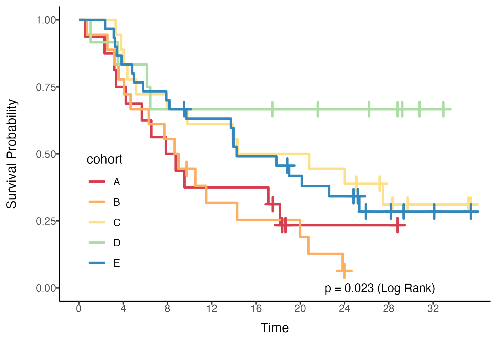

```{r setup, include=FALSE}
knitr::opts_chunk$set(echo = TRUE,message = F,warning = F)
library(reportRmd)
# This is necessary to ensure that the figures appear on the website.
if (! file.exists('.nojekyll')) file.create('.nojekyll')
if (! file.exists('docs/.nojekyll')) file.create('docs/.nojekyll')
suppressWarnings(library(kableExtra))
```

# Overview
reportRmd is a package designed to facilitate the reporting of common statistical outputs easily in RMarkdown documents. The package supports pdf, html and word output without any changes to the body of the report. The main features are Table 1 style summaries, combining multiple univariate regression models into a single table, tidy multivariable model output and combining univariate and multivariable regressions into a single table. Single table summaries of median survival times and survival probabilities are also provided. A highly customisable survival curve function, based on ggplot2 can be used to create publication-quality plots. Visualisation plots are also available for bivariate relationships and logistic regression models. 

**A word of caution:**

The reportRmd package is designed to facilitate statistical reporting and does not provide any checks regarding the suitability of the models fit. 

<!--
## Styles
Currently `html_pretty` supports three page themes, `cayman` (the default),
`tactile`, and `architect`. And there are also two syntax highlight styles:
`github` to mimic the syntax highlight on Github, and `vignette` that is used by
`html_vignette`. If no highlight parameter is given, the default style created
by Pandoc will be used.
-->

# Summary statistics 

Basic summary statistics


```{r}
rm_covsum(data=pembrolizumab, 
covs=c('age','sex'))

```

Set `IQR = T` for interquartile range instead of Min/Max

```{r}
rm_covsum(data=pembrolizumab, 
covs=c('age','sex'),IQR=TRUE)

```

Or `all.stats=T` for both
```{r}
rm_covsum(data=pembrolizumab, 
covs=c('age','sex'),all.stats = TRUE)

```

## Summaries By Group

This will produce summary statistics by Sex

```{r}
rm_covsum(data=pembrolizumab, maincov = 'sex',
covs=c('age','pdl1','change_ctdna_group'))

```

## Showing Statistical Tests
To indicate which statistical test was used  use `show.tests=TRUE`


```{r}
rm_covsum(data=pembrolizumab, maincov = 'sex',
covs=c('age','pdl1','change_ctdna_group'),
show.tests=TRUE)

```

## Parametric vs Non-parametric Comparisons

Group comparisons are non-parametric by default, specify `testcont='ANOVA'` for t-tests/ANOVA

```{r}
rm_covsum(data=pembrolizumab, maincov = 'sex',
covs=c('age','pdl1'),
testcont='ANOVA',
show.tests=TRUE)

```

## Row vs Column Summaries

The default is to indicate percentages by columns (ie percentages within columns add to 100)

```{r}
rm_covsum(data=pembrolizumab, maincov = 'sex',
covs=c('cohort'),
pvalue = FALSE)

```

But you can also specify to show by row instead

```{r}
rm_covsum(data=pembrolizumab, maincov = 'sex',
covs=c('cohort'),
pvalue = FALSE,
percentage='row')

```


# Univariate regression

Combining multiple univariate regression analyses into a single table. The function will try to determine the most appropriate model from the data.

```{r }
rm_uvsum(data=pembrolizumab, response='orr',
covs=c('age','pdl1','change_ctdna_group'))

```

## Simple Linear Regression
If the response is continuous linear regression is the default. Using `type = 'linear'` will ensure linear regression.

```{r }
rm_uvsum(data=pembrolizumab, response='l_size',
covs=c('age','cohort'))
```

## Logistic Regression
If the response is binomial, logistic regression will be run (or specified with `type = 'logistic'`).

```{r }
rm_uvsum(data=pembrolizumab, response='orr',
covs=c('age','cohort'))
```

## Poisson Regression
If the response is integer, poisson regression will be run (or specified with `type = 'poisson'`).

```{r }
pembrolizumab$Counts <- rpois(nrow(pembrolizumab),lambda = 3)
rm_uvsum(data=pembrolizumab, response='Counts',
covs=c('age','cohort'))
```

## Survival Analysis
If two response variables are specified and then survival analysis is run (specified with `type='coxph'`).

```{r }
rm_uvsum(data=pembrolizumab, response=c('os_time','os_status'),
covs=c('age','pdl1','change_ctdna_group'))
```

## Competing Risk

Competing risk models need to be explicitly specified using `type='crr'`.

```{r }
rm_uvsum(data=pembrolizumab, response=c('os_time','os_status'),
covs=c('age','pdl1','change_ctdna_group'),
type='crr')
```

## GEE Models
Correlated observations can be handled using GEE

```{r}
 rm_uvsum(response = 'size_change',
 covs=c('time','ctdna_status'),
 gee=TRUE,
 id='id', corstr="exchangeable",
 family=gaussian("identity"),
 data=ctDNA,showN=TRUE)
```

## Returning Model Objects
If you want to check the underlying models, set `returnModels = TRUE`

```{r}
 rm_uvsum(response = 'orr',
 covs=c('age'),
 data=pembrolizumab,returnModels = TRUE)
```

The data analysed can be examined by interrogating the data object appended to each model

```{r}
mList <-  rm_uvsum(response = 'orr',
 covs=c('age'),
 data=pembrolizumab,returnModels = TRUE)
head(mList$age$data)

```

## Adjusting p-values

Multiple comparisons can be controlled for with the p.adjust argument, which accepts any of the options from the `p.adjust` function.

```{r}
 rm_uvsum(response = 'orr',
 covs=c('age','sex','pdl1'),
 data=pembrolizumab,p.adjust = 'fdr')
```

**Note:** The raw p-value column is suppressed when there are categorical variables with >2 levels, to prevent three columns of p-values from appearing.

\newpage

# Multivariable analysis

To create a nice display for multivariable models the multivariable model first needs to be fit. 

By default, the variance inflation factor will be shown to check for multicollinearity. To suppress this column set `vif=FALSE`. Note: variance inflation factors are not computed (yet) for multilevel or GEE models.

```{r}
glm_fit <- glm(orr~change_ctdna_group+pdl1+age,
               family='binomial',
               data = pembrolizumab)
rm_mvsum(glm_fit, showN = TRUE, vif=TRUE)
```


# Combining univariate and multivariable models

To display both models in a single table run the rm_uvsum and rm_mvsum functions with `tableOnly=TRUE` and combine.

```{r}
uvsumTable <- rm_uvsum(data=pembrolizumab, response='orr',
covs=c('age','sex','pdl1','change_ctdna_group'),tableOnly = TRUE)

glm_fit <- glm(orr~change_ctdna_group+pdl1,
               family='binomial',
               data = pembrolizumab)
mvsumTable <- rm_mvsum(glm_fit, showN = TRUE,tableOnly = TRUE)

rm_uv_mv(uvsumTable,mvsumTable)
```

**Note:** This can also be done with adjusted p-values, but when combined the raw p-values are dropped.


# Changing the output

If you need to make changes to the tables, setting `tableOnly=TRUE` will return  a data frame for any of the `rm_` functions. Changes can be made, and the table output using `outTable()`

```{r}
mvsumTable <- rm_mvsum(glm_fit, showN = TRUE,tableOnly = TRUE)
names(mvsumTable)[1] <-'Predictor'
outTable(mvsumTable)
```

# Combining tables

Tables can be nested with the `nestTable()` function
```{r}
cohortA <- rm_uvsum(data=subset(pembrolizumab,cohort=='A'), 
                     response = 'pdl1',
                     covs=c('age','sex'),
                     tableOnly = T)
cohortA$Cohort <- 'Cohort A'
cohortE <- rm_uvsum(data=subset(pembrolizumab,cohort=='E'), 
                     response = 'pdl1',
                     covs=c('age','sex'),
                     tableOnly = T)
cohortE$Cohort <- 'Cohort E'
nestTable(rbind(cohortA,cohortE),head_col = 'Cohort',to_col = 'Covariate')

```

\newpage

# Simple Survival Summaries 

Displaying survival probabilities at different times by sex using Kaplan Meier estimates

```{r}
rm_survsum(data=pembrolizumab,time='os_time',status='os_status',
 group="sex",survtimes=seq(12,36,12),survtimeunit='months')

```

\newpage

# Survival Times in Long Format

Displaying survival probabilities at different times by sex using Cox PH estimates

```{r}
rm_survtime(data=pembrolizumab,time='os_time',status='os_status',
 strata="sex",survtimes=c(12,24),survtimeunit='mo',type='PH')

```

## Survival Times With Covariate Adjustments
Displaying survival probabilities at different times by sex, adjusting for age using Cox PH estimates

```{r}
rm_survtime(data=pembrolizumab,time='os_time',status='os_status', covs='age',
 strata="sex",survtimes=c(12,24),survtimeunit='mo',type='PH')

```


# Stratified Survival Summary
To combine estimates across strata

```{r}
rm_survdiff(data=pembrolizumab,time='os_time',status='os_status', 
            covs='sex',strata='cohort',digits=1)
```


# Plotting Functions



## Plotting bivariate relationships

These plots are designed for quick inspection of many variables, not for publication. This is the plotting version of rm_uvsum

```{r, eval=FALSE,echo=TRUE}
plotuv(data=pembrolizumab, response='orr',
covs=c('age','cohort','pdl1','change_ctdna_group'))

```

```{r, eval=FALSE,echo=FALSE}
plotuv(data=pembrolizumab, response='orr',
covs=c('age','cohort','pdl1','change_ctdna_group'))
ggsave('images/plotuv.png',width = 5,height = 4,dpi = 300)
```


## Plotting odds ratios

This will default to a log scale, but can be set to linear using `logscale=FALSE`
```{r, eval=F,echo=T}
require(ggplot2)
glm_fit <- glm(orr~age+sex+change_ctdna_group+pdl1,
               family='binomial',
               data = pembrolizumab)
forestplot2(glm_fit)
```

```{r, eval=F,echo=F}
require(ggplot2)
glm_fit <- glm(orr~age+sex+change_ctdna_group+pdl1,
               family='binomial',
               data = pembrolizumab)
ggsave('images/forestplot.png',height = 2,width = 5,dpi=300)
forestplot2(glm_fit) + theme(axis.ticks.y =  element_blank(),
                             axis.text.y = element_blank())
ggsave('images/forestplot_sm.png',height = 1,width =3)
```


\newpage

## Plotting survival curves

```{r, eval=F,echo=T}
ggkmcif(response = c('os_time','os_status'),
cov='cohort',
data=pembrolizumab)
```

```{r, eval=F,echo=FALSE}
ggkmcif(response = c('os_time','os_status'),
cov='cohort',
data=pembrolizumab)
# # doesn't work - need to save manually
# ggsave('images/ggkmcif.png',dpi=300,width = 5,height = 5)
p <- ggkmcif(response = c('os_time','os_status'),
cov='cohort',
data=pembrolizumab,returns = T)
plot(p[[1]])
ggsave('images/ggkmcif_sm.png',width = 4,height = 2.5)
```


\newpage

# PDF Output

For pdf to be correctly generate when using survival curves it is recommended that the cairo format be used. This can be specified with the following command in the setup code chunk:

`knitr::opts_chunk$set(message = FALSE, warning = FALSE,dev="cairo_pdf")`


# Data Sets

### pembrolizumab


Survival status and ctDNA levels for patients receiving pembrolizumab

A data frame with 94 rows and 15 variables:


- **id** Patient ID
- **age** Age at study entry
- **sex** Patient Sex
- **cohort** Study Cohort: A = Squamous cell carcinoma of soft pallate, B = Triple negative breast cancer, C = Ovarian, high grade serous, D = Melanoma, E = Other Solid Tumor
- **l_size** Target lesion size at baseline
- **pdl1** PD L1 percent
- **tmb** log of TMB
- **baseline_ctdna** Baseline ctDNA
- **change_ctdna_group** Did ctDNA increase or decrease from baseline to cycle 3
- **orr** Objective Response
- **cbr** Clinical Beneficial Response
- **os_status** Overall survival status, 0 = alive, 1 = deceased
- **os_time** Overall survival time in months
- **pfs_status** Progression free survival status, 0 = progression free, 1 = progressed
- **pfs_time** Progression free survival time in months


### ctDNA

Longitudinal changes in tumour size since baseline for patients by changes in ctDNA status (clearance, decrease or increase) since baseline.

A data frame with 270 rows and 5 variables:

- **id** Patient ID
- **cohort** Study Cohort: A = Squamous cell carcinoma of soft pallate, B = Triple negative breast cancer, C = Ovarian, high grade serous, D = Melanoma, E = Other Solid Tumor
- **ctdna_status** Change in ctDNA since baseline
- **time** Number of weeks on treatment
- **size_change** Percentage change in tumour measurement


