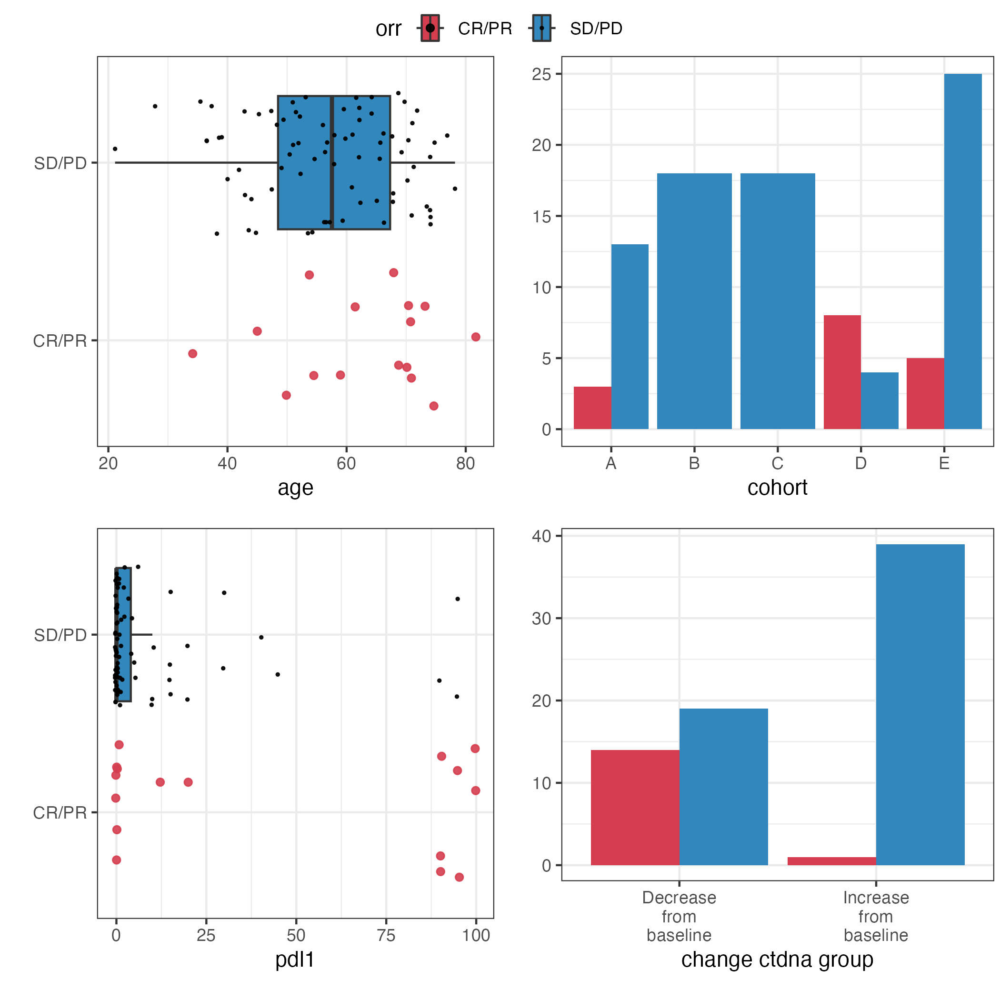

# Overview

reportRmd is a package designed to facilitate the reporting of common statistical outputs easily in RMarkdown documents. The package supports pdf, html and word output without any changes to the body of the report. The main features are Table 1 style summaries, combining multiple univariate regression models into a single table, tidy multivariable model output and combining univariate and multivariable regressions into a single table. Single table summaries of median survival times and survival probabilities are also provided. A highly customisable survival curve function, based on ggplot2 can be used to create publication-quality plots. Visualisation plots are also available for bivariate relationships and logistic regression models.

A word of caution:

The reportRmd package is designed to facilitate statistical reporting and does not provide any checks regarding the suitability of the models fit.

<!--
## Styles
Currently `html_pretty` supports three page themes, `cayman` (the default),
`tactile`, and `architect`. And there are also two syntax highlight styles:
`github` to mimic the syntax highlight on Github, and `vignette` that is used by
`html_vignette`. If no highlight parameter is given, the default style created
by Pandoc will be used.
-->

```{r setup, include=FALSE}
library(reportRmd)
# knitr::opts_chunk$set(message = FALSE, warning = FALSE,dev="cairo_pdf")
knitr::opts_chunk$set(message = FALSE, warning = FALSE)
```

\newpage

# Summary statistics 

Basic summary statistics

```{r}
data("pembrolizumab")
rm_covsum(data=pembrolizumab, 
covs=c('age','sex'))
```

Set `IQR = T` for interquartile range instead of Min/Max

```{r}
rm_covsum(data=pembrolizumab, 
covs=c('age','sex'),IQR=TRUE)
```

Or `all.stats=T` for both
```{r}
rm_covsum(data=pembrolizumab, 
covs=c('age','sex'),all.stats = TRUE)
```

## Summaries By Group

This will produce summary statistics by Sex

```{r}
rm_covsum(data=pembrolizumab, maincov = 'sex',
covs=c('age','pdl1','change_ctdna_group'))
```

## Showing Statistical Tests

To indicate which statistical test was used  use `show.tests=TRUE`

```{r}
rm_covsum(data=pembrolizumab, maincov = 'sex',
covs=c('age','pdl1','change_ctdna_group'),
show.tests=TRUE)
```

## Including Effect Sizes

Effect sizes can be added with `effSize = TRUE`. Effect size measures include the Wilcoxon r for Wilcoxon rank-sum test, Cohen's d for t-test, Omega for ANOVA, Epsilon for Kruskal Wallis test, and Cramer's V for categorical variables.

```{r}
rm_covsum(data=pembrolizumab, maincov = 'sex',
covs=c('age','change_ctdna_group'),
effSize=TRUE)
```

## Parametric vs Non-parametric Comparisons

Group comparisons are non-parametric by default, specify `testcont='ANOVA'` for t-tests/ANOVA

```{r}
rm_covsum(data=pembrolizumab, maincov = 'sex',
covs=c('age','pdl1'),
testcont='ANOVA',
show.tests=TRUE, effSize=TRUE)
```

## Row vs Column Summaries

The default is to indicate percentages by columns (ie. percentages within columns add to 100)

```{r}
rm_covsum(data=pembrolizumab, maincov = 'sex',
covs=c('cohort'),
pvalue = FALSE)
```

But you can also specify to show by row instead

```{r}
rm_covsum(data=pembrolizumab, maincov = 'sex',
covs=c('cohort'),
pvalue = FALSE,
percentage='row')
```

\newpage

# Compact summary statistics 

Basic summary statistics

```{r}
rm_compactsum(data = pembrolizumab, xvars = c("change_ctdna_group", "l_size"))
```

Set `iqr = T` for interquartile range instead of Min/Max

```{r}
rm_compactsum(data=pembrolizumab, xvars = c("change_ctdna_group", "l_size"), iqr=TRUE)
```

Or `all.stats=T` for both

```{r}
rm_compactsum(data=pembrolizumab, xvars = c("change_ctdna_group", "l_size"), all.stats = T)
```

## Summaries By Group
This will produce summary statistics by Sex:

```{r}
rm_compactsum(data=pembrolizumab, xvars=c('age','pdl1','change_ctdna_group'), grp = 'sex')
```

## Showing Statistical Tests
To indicate which statistical test was used use `show.tests=TRUE`

```{r}
rm_compactsum(data=pembrolizumab, xvars=c('age','pdl1','change_ctdna_group'), grp = 'sex', show.tests=TRUE)
```

## Including Effect Sizes
Effect sizes can be added with `effSize = TRUE`. If `show.tests = TRUE` as well, the effStat will also be shown:

```{r}
rm_compactsum(data=pembrolizumab, xvars=c('age','pdl1','change_ctdna_group'), grp = 'sex', effSize = T, show.tests = T)
```

## Using Mean Summary Statistic Instead of Median
The default summary statistic for numerical variables is median. To specify which numerical variables should have mean displayed instead, change the `use_mean` argument. Unspecified xvars will use the default median

```{r}
rm_compactsum(data=pembrolizumab, xvars=c('age','pdl1','change_ctdna_group'), grp = 'sex', use_mean = c("pdl1"), effSize = T, show.tests = T)
```

## Custom Digits Argument
The digits and digits.cat arguments can be changed to a custom numerical value. The default digits is 1, the default digits.cat is 0

```{r}
rm_compactsum(data=pembrolizumab, xvars=c('age','pdl1','change_ctdna_group'), grp = 'sex', use_mean = c("pdl1"), digits = 2, digits.cat = 1, effSize = T, show.tests = T)
```

To specify custom digit arguments for different numerical variables, change the `digits` argument. Unspecified variables will use the default value.

```{r}
rm_compactsum(data=pembrolizumab, xvars=c('age','pdl1','l_size'), grp = 'sex', digits = c("age" = 3, "l_size" = 2), effSize = T, show.tests = T)
```

## Row vs Column Summaries
The default is to indicate percentages by columns (ie. percentages within columns add to 100). But you can also specify to show by row instead

```{r}
rm_compactsum(data=pembrolizumab, xvars=c('change_ctdna_group','orr'), grp = 'cohort', effSize = T, show.tests = T, percentage = "row")
```

## Viewing the Self-Generated Description
To view the self-generated description for the summary table:

```{r, results = 'asis'}
summary_tab <- rm_compactsum(data=pembrolizumab, xvars=c('change_ctdna_group','orr', 'age'), grp = 'cohort', effSize = T, show.tests = T)
cat(attr(summary_tab, "description"))
```


\newpage

# Univariate regression

Combining multiple univariate regression analyses into a single table. The function will try to determine the most appropriate model from the data.

```{r }
rm_uvsum(data=pembrolizumab, response='orr',
covs=c('age','pdl1','change_ctdna_group'))
```

## Simple Linear Regression
If the response is continuous linear regression is the default. Using `type = 'linear'` will ensure linear regression.

```{r }
rm_uvsum(data=pembrolizumab, response='l_size',
covs=c('age','cohort'))
```

## Logistic Regression
If the response is binomial, logistic regression will be run (or specified with `type = 'logistic'`).

```{r }
rm_uvsum(data=pembrolizumab, response='orr',
covs=c('age','cohort'))
```

## Poisson Regression
If the response is integer, poisson regression will be run (or specified with `type = 'poisson'`).

```{r }
pembrolizumab$Counts <- rpois(nrow(pembrolizumab),lambda = 3)
rm_uvsum(data=pembrolizumab, response='Counts',covs=c('age','cohort'))
```

offset terms can be specified as well, but must correspond to a variable in the data set 

```{r}
pembrolizumab$length_followup <- rnorm(nrow(pembrolizumab),mean = 72,sd=3)
pembrolizumab$log_length_followup <- log(pembrolizumab$length_followup)
rm_uvsum(data=pembrolizumab, response='Counts',covs=c('age','cohort'),
         offset = "log_length_followup")
```

## Negative Binomial Regression
To run negative binomial regression instead specify  `type = 'negbin'`

```{r }
rm_uvsum(data=pembrolizumab, response='Counts', type='negbin',
         covs=c('age','cohort'),
         offset = "log_length_followup")
```

## Survival Analysis
If two response variables are specified and then survival analysis is run (specified with `type='coxph'`).

```{r }
rm_uvsum(data=pembrolizumab, response=c('os_time','os_status'),
covs=c('age','pdl1','change_ctdna_group'))
```

## Competing Risk
Competing risk models need to be explicitly specified using `type='crr'`.

```{r }
rm_uvsum(data=pembrolizumab, response=c('os_time','os_status'),
covs=c('age','pdl1','change_ctdna_group'),
type='crr')
```

## GEE Models
Correlated observations can be handled using GEE

```{r}
data("ctDNA")
 rm_uvsum(response = 'size_change',
 covs=c('time','ctdna_status'),
 gee=TRUE,
 id='id', corstr="exchangeable",
 family=gaussian("identity"),
 data=ctDNA,showN=TRUE)
```

## Returning Model Objects
If you want to check the underlying models, set `returnModels = TRUE`

```{r}
 rm_uvsum(response = 'orr',
 covs=c('age'),
 data=pembrolizumab,returnModels = TRUE)
```

The data analysed can be examined by interrogating the data object appended to each model

```{r}
mList <-  rm_uvsum(response = 'orr',
 covs=c('age'),
 data=pembrolizumab,returnModels = TRUE)
head(mList$age$data)
```

## Adjusting p-values
Multiple comparisons can be controlled for with the p.adjust argument, which accepts any of the options from the `p.adjust` function.

```{r}
 rm_uvsum(response = 'orr',
 covs=c('age','sex','pdl1'),
 data=pembrolizumab,p.adjust = 'fdr')
```

**Note:** The raw p-value column is suppressed when there are categorical variables with >2 levels, to prevent three columns of p-values from appearing.

\newpage

# Multivariable analysis

To create a nice display for multivariable models the multivariable model first needs to be fit. 

By default, the variance inflation factor will be shown to check for multicollinearity. To suppress this column set `vif=FALSE`. Note: variance inflation factors are not computed (yet) for multilevel or GEE models.

```{r}
glm_fit <- glm(orr~change_ctdna_group+pdl1+age,
               family='binomial',
               data = pembrolizumab)
rm_mvsum(glm_fit, showN = TRUE, vif=TRUE)
```

p-values can be adjusted for multiple comparisons using any of the options available in the `p.adjust` function. This argument is also available for univariate models run with rm_uvsum.

```{r}
rm_mvsum(glm_fit, showN = TRUE, vif=TRUE,p.adjust = 'holm')
```

# Combining univariate and multivariable models

To display both models in a single table run the rm_uvsum and rm_mvsum functions with `tableOnly=TRUE` and combine.

```{r}
uvsumTable <- rm_uvsum(data=pembrolizumab, response='orr',
covs=c('age','sex','pdl1','change_ctdna_group'),tableOnly = TRUE)

glm_fit <- glm(orr~change_ctdna_group+pdl1,
               family='binomial',
               data = pembrolizumab)
mvsumTable <- rm_mvsum(glm_fit, showN = TRUE,tableOnly = TRUE)

rm_uv_mv(uvsumTable,mvsumTable)
```

**Note:** This can also be done with adjusted p-values, but when combined the raw p-values are dropped.

```{r}
uvsumTable <- rm_uvsum(data=pembrolizumab, response='orr',
covs=c('age','sex','pdl1','change_ctdna_group'),tableOnly = TRUE,p.adjust='holm')

glm_fit <- glm(orr~change_ctdna_group+pdl1,
               family='binomial',
               data = pembrolizumab)
mvsumTable <- rm_mvsum(glm_fit,tableOnly = TRUE,p.adjust='holm')

rm_uv_mv(uvsumTable,mvsumTable)
```

# Changing the output

If you need to make changes to the tables, setting `tableOnly=TRUE` will return  a data frame for any of the `rm_` functions. Changes can be made, and the table output using `outTable()`

```{r}
mvsumTable <- rm_mvsum(glm_fit, showN = TRUE,tableOnly = TRUE)
names(mvsumTable)[1] <-'Predictor'
outTable(mvsumTable)
```

# Combining tables

Tables can be nested with the `nestTable()` function

```{r}
cohortA <- rm_uvsum(data=subset(pembrolizumab,cohort=='A'), 
                     response = 'pdl1',
                     covs=c('age','sex'),
                     tableOnly = T)
cohortA$Cohort <- 'Cohort A'
cohortE <- rm_uvsum(data=subset(pembrolizumab,cohort=='E'), 
                     response = 'pdl1',
                     covs=c('age','sex'),
                     tableOnly = T)
cohortE$Cohort <- 'Cohort E'
nestTable(rbind(cohortA,cohortE),head_col = 'Cohort',to_col = 'Covariate')

```

\newpage

# Simple Survival Summaries 

Displaying survival probabilities at different times by sex using Kaplan Meier estimates

```{r}
rm_survsum(data=pembrolizumab,time='os_time',status='os_status',
 group="sex",survtimes=seq(12,36,12),survtimeunit='months')
```

\newpage

# Survival Times in Long Format

Displaying survival probabilities at different times by sex using Cox PH estimates

```{r}
rm_survtime(data=pembrolizumab,time='os_time',status='os_status',
 strata="sex",survtimes=c(12,24),survtimeunit='mo',type='PH')
```

## Survival Times With Covariate Adjustments
Displaying survival probabilities at different times by sex, adjusting for age using Cox PH estimates

```{r}
rm_survtime(data=pembrolizumab,time='os_time',status='os_status', covs='age',
 strata="sex",survtimes=c(12,24),survtimeunit='mo',type='PH')
```

# Stratified Survival Summary
To combine estimates across strata

```{r}
rm_survdiff(data=pembrolizumab,time='os_time',status='os_status', 
            covs='sex',strata='cohort',digits=1)
```

\newpage

# Working with Labels

New in version 0.1.0 is the ability to incorporate variable labels into summary tables (but not yet plots). If variables contain a `label` attribute this will be displayed automatically, to disable this set `nicenames=F`

Variable labels will be shown in the `nicenames` argument is set to `TRUE` (the default). Variable labels are set using the `label` attribute of individual variables (assigned using `reportRmd` or another package like `haven`).

`reportRmd` supports the addition, removal and export of labels using the following functions:

-   `set_labels` will set labels for a data frame from a lookup table
-   `set_var_labels` allows you to set individual variable labels to a data frame
-   `clear_labels` removes all labels from a data frame
-   `export_labels` extracts variable labels from a data frame and returns a data frame of variable names and variable labels

## Worked Example

Get some descriptive stats for the ctDNA data that comes with the package. The `nicenames` argument is TRUE by default so underscores are replaced by spaces

```{r}
rm_covsum(data=ctDNA,
          covs=c('cohort','ctdna_status','size_change'))

```

### set_labels {#sec-set_labels}

If we have a lookup table of variable names and labels that we imported from a data dictionary we can set the variable labels for the data frame and these will be used in the `rm_` functions

```{r}

ctDNA_names <- data.frame(var=names(ctDNA),
                          label=c('Patient ID',
                                  'Study Cohort',
                                  'Change in ctDNA since baseline',
                                  'Number of weeks on treatment',
                                  'Percentage change in tumour measurement'))
ctDNA <- set_labels(ctDNA,ctDNA_names)

rm_covsum(data=ctDNA,
          covs=c('cohort','ctdna_status','size_change'))
```

### set_var_labels {#sec-set_var_labels}

Individual labels can be changed with with the `set_var_labels` command

```{r}
ctDNA <- set_var_labels(ctDNA,
                        cohort="A new cohort label")
rm_covsum(data=ctDNA,
          covs=c('cohort','ctdna_status','size_change'))
```

### extract_labels {#sec-extract_labels}

Extract the variable labels to a data frame

```{r}
var_labels <- extract_labels(ctDNA)
var_labels
```

### clear_labels {#sec-clear_labels}
Or clear them all

```{r}
ctDNA <- clear_labels(ctDNA)
```

\newpage

# Plotting Functions

{width=100%}{width=100%}

## Plotting bivariate relationships

These plots are designed for quick inspection of many variables, not for publication. This is the plotting version of rm_uvsum

```{r, eval=FALSE,echo=TRUE}
plotuv(data=pembrolizumab, response='orr',
covs=c('age','cohort','pdl1','change_ctdna_group'))
```

```{r, eval=FALSE,echo=FALSE}
plotuv(data=pembrolizumab, response='orr',
covs=c('age','cohort','pdl1','change_ctdna_group'))
ggsave('images/plotuv.png',scale = 0.5,dpi = 300)
```

{width=100%}

The plotuv function can also be used without a response variable to display summary of variables

```{r, eval=FALSE,echo=TRUE}
plotuv(data = pembrolizumab, covs=c('age','cohort','pdl1','change_ctdna_group'), showN = T)
```

```{r, eval=FALSE,echo=FALSE}
plotuv(data = pembrolizumab, covs=c('age','cohort','pdl1','change_ctdna_group'), showN = T)
ggsave('images/plotuv_nores.png',scale = 0.5,dpi = 300)
```

{width=100%}

\newpage

## Plotting survival curves
Survival curves are now ggplot2-based, the older version, ggkmcif is deprecated from version 0.1.0

```{r, eval=F,echo=T}
ggkmcif2(response = c('os_time','os_status'),
cov='cohort',
data=pembrolizumab)
```

```{r, eval=F,echo=FALSE}
ggkmcif2(response = c('os_time','os_status'),
cov='cohort',
data=pembrolizumab)
ggsave('images/ggkmcif.png',dpi=300,width = 5,height = 5)
p <- ggkmcif2(response = c('os_time','os_status'),
cov='cohort',
data=pembrolizumab,returns = T)
plot(p[[1]])
ggsave('images/ggkmcif_sm.png',scale = 0.5)
```

{width=100%}
\newpage

## Forest Plots

Similar to `rm_uvsum` and `rm_mvsum`, forest plots can be created from univariate or multivariable models. forestplot2 is deprecated from version 0.1.0

This will default to a log scale, but can be set to linear using `logScale=FALSE`

```{r, eval=F,echo=T}
forestplotUV(response="orr", covs=c("change_ctdna_group", "sex", "age", "l_size"),
data=pembrolizumab, family='binomial')
```

```{r, eval=F,echo=FALSE}
forestplotUV(response="orr", covs=c("change_ctdna_group", "sex", "age", "l_size"),
data=pembrolizumab, family='binomial')
ggsave('images/forestuv.png', scale = 0.5)
```

{width=100%}
### Multivariable Model Forest Plot

```{r, eval=F,echo=T}
glm_fit <- glm(orr~change_ctdna_group+pdl1+age,
               family='binomial',
               data = pembrolizumab)
forestplotMV(glm_fit)
```

```{r, eval=F,echo=FALSE}
glm_fit <- glm(orr~change_ctdna_group+pdl1+age,
               family='binomial',
               data = pembrolizumab)
forestplotMV(glm_fit)
ggsave('images/forestmv.png', scale = 0.5)
```

{width=100%}

## Combining univariable and multivariable models into a single plot

```{r, eval=F,echo=T}
UVp = forestplotUV(response="orr", covs=c("change_ctdna_group", "sex", "age",
 "l_size"), data=pembrolizumab, family='binomial')
 MVp = forestplotMV(glm(orr~change_ctdna_group+sex+age+l_size,
 data=pembrolizumab,family = 'binomial'))
 forestplotUVMV(UVp, MVp)
```

```{r, eval=F,echo=F}
UVp = forestplotUV(response="orr", covs=c("change_ctdna_group", "sex", "age",
 "l_size"), data=pembrolizumab, family='binomial')
 MVp = forestplotMV(glm(orr~change_ctdna_group+sex+age+l_size,
 data=pembrolizumab,family = 'binomial'))
 forestplotUVMV(UVp, MVp)
ggsave('images/forestuvmv.png', scale = 0.5)
```

{width=100%}

This can also be done with linear scale odds ratios. Number of subjects and/or number of events can also be turned off, as well as different colours used.

```{r, eval=F,echo=T}
uvFP <- forestplotUV(data=pembrolizumab, response='orr',
covs=c('age','sex','pdl1','change_ctdna_group'))

glm_fit <- glm(orr~change_ctdna_group+pdl1,
               family='binomial',
               data = pembrolizumab)
mvFP <- forestplotMV(glm_fit)

forestplotUVMV(uvFP,mvFP,showN=F,showEvent=F,colours=c("orange","black","blue"),logScale=F)
```

```{r, eval=F,echo=F}
uvFP <- forestplotUV(data=pembrolizumab, response='orr',
covs=c('age','sex','pdl1','change_ctdna_group'))

glm_fit <- glm(orr~change_ctdna_group+pdl1,
               family='binomial',
               data = pembrolizumab)
mvFP <- forestplotMV(glm_fit)

forestplotUVMV(uvFP,mvFP,showN=F,showEvent=F,colours=c("orange","black","blue"),logScale=F)
ggsave('images/forestuvmvlin.png', scale = 0.5)
```

{width=100%}

\newpage
# Miscellaneous Functions

## excelCol
To identify the number of a column given the Excel column header
```{r}
excelCol(G,AB,Az)

```

## excelColLetters
To identify the Excel header given a columns number

```{r}
excelColLetters(c(7,28,52))
```

\newpage

# Options

The following options can be set:

-   reportRmd.digits, default is 2. Sets the default number of digits in output functions. Does not affect p-values.
-   reportRmd.forceWald, default is FALSE. If set to TRUE then Wald CI, as opposed to likelihood profile CI will be used in the rm_uvsum function.
-   reportRmd.logScale, default is TRUE. The scale of the forest plots will default to log unless otherwise specified.

Example:

```{r}
 rm_uvsum(response = 'baseline_ctdna',
 covs=c('age','sex','l_size','pdl1','tmb'),
 data=pembrolizumab)
 
 options('reportRmd.digits'=1) 
 
rm_uvsum(response = 'baseline_ctdna',
 covs=c('age','sex','l_size','pdl1','tmb'),
 data=pembrolizumab)
```

\newpage

# PDF Output

For pdf to be correctly generate when using survival curves it is recommended that the cairo format be used. This can be specified with the following command in the setup code chunk:

`knitr::opts_chunk$set(message = FALSE, warning = FALSE,dev="cairo_pdf")`

# Data Sets

## pembrolizumab

Survival status and ctDNA levels for patients receiving pembrolizumab

A data frame with 94 rows and 15 variables:

- **id** Patient ID
- **age** Age at study entry
- **sex** Patient Sex
- **cohort** Study Cohort: A = Squamous cell carcinoma of soft pallate, B = Triple negative breast cancer, C = Ovarian, high grade serous, D = Melanoma, E = Other Solid Tumor
- **l_size** Target lesion size at baseline
- **pdl1** PD L1 percent
- **tmb** log of TMB
- **baseline_ctdna** Baseline ctDNA
- **change_ctdna_group** Did ctDNA increase or decrease from baseline to cycle 3
- **orr** Objective Response
- **cbr** Clinical Beneficial Response
- **os_status** Overall survival status, 0 = alive, 1 = deceased
- **os_time** Overall survival time in months
- **pfs_status** Progression free survival status, 0 = progression free, 1 = progressed
- **pfs_time** Progression free survival time in months

## ctDNA

Longitudinal changes in tumour size since baseline for patients by changes in ctDNA status (clearance, decrease or increase) since baseline.

A data frame with 270 rows and 5 variables:

- **id** Patient ID
- **cohort** Study Cohort: A = Squamous cell carcinoma of soft pallate, B = Triple negative breast cancer, C = Ovarian, high grade serous, D = Melanoma, E = Other Solid Tumor
- **ctdna_status** Change in ctDNA since baseline
- **time** Number of weeks on treatment
- **size_change** Percentage change in tumour measurement
